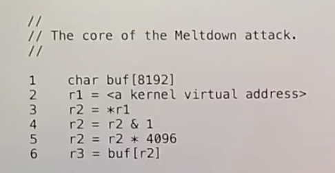
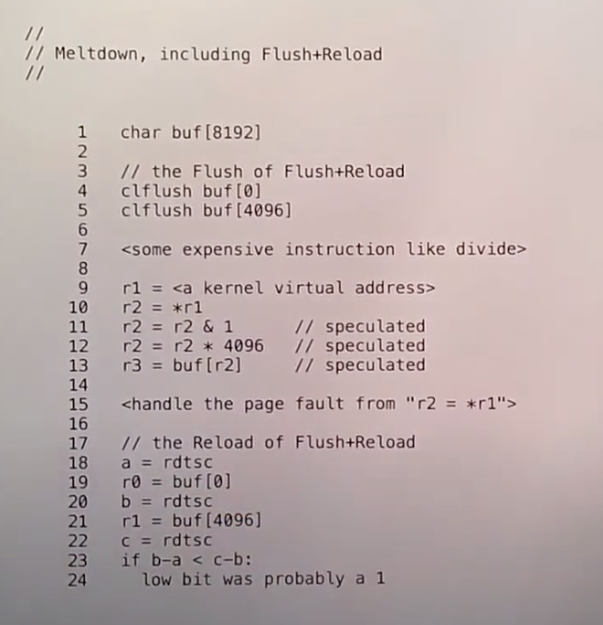

# meltdown
## 背景

meltdown是`micro-architecture`攻击，利用了cpu内部隐藏的一些细节，比如乱序执行。

核心代码如下
 

在用户空间对内核的访问是不被允许的，这种访问会出发`pagefault`。
系统设计者将内核空间也映射到了用户空间的页表上了，因此系统调用等陷入内核的操作不需要切换页表了，大大提高了运行速度。不过这也给meltdown创造了机会。


## speculative execution
预测执行其实就是分支预测之后的指令执行。不过由于分支预测可能失败，所以预测执行时使用的仅存其实际上是一些临时的寄存器，方便预测失败后进行回滚操作。

```c
int t1,t2,t3;
int t4 = random();
if(t4 % 2){
  t1 = *p;
  t2 = t1;
}else{
  t3 = 1;
}

```
在上述代码段中，t4是随机值，假设分支预测总是预测真，则会访问p指向的内容，这属于预测执行，但如果p地址不可访问，我们也不能产生fault,因为他没有真的运行，必须等到分支确定之后才可以产生对应的fault.

retired:指的是代码确定被回滚或执行的一个状态。

当p地址是内核地址时，cpu也会读取对应的数据，存放在临时寄存器中。直到读取p地址的指令retired后，cpu才会发现这个行为是一个错误的行为，会产生pagefault，并对操作进行回滚。
**注意这种操作在amd的机器上不生效,原因在于amd和intel的微架构实现不同，amd在进行推测执行时也会进行权限检查，而intel没有检查**


## cache
l1cache : 使用虚存地址索引，速度最快，并且包含了pte权限
l2cache : 物理地址

微架构的初衷是对用户完全透明的，但是也会有疏忽，而且实际上cpu厂商要对许多细节进行说明，以便编译器等高性能软件的优化。

## flush N load
流程
1. intel提供了一条指令 `clflush` 用于将cache中指定地址的数据删除。
2. 执行你觉得对某个地址x访问了的代码
3. 检查内存是否在cache中，使用`rdtsc`指令，可以返回cpu启动后总共经过了多少个`cycle`
4. 访存x地址处
5. 再次使用`rdtsc`如果相差较少，则在cache中，否则不在。

## metldown
 
大致思路就是利用乱序执行或预测执行，让访问敏感数据的指令也被部分或全部执行(retired)，将敏感数据留在cache中，然后利用cache访问的时间来判断哪个数据是敏感数据。

## fix
KAISER是meltdown论文发表后很快推出的一个修复措施，将内核和用户的页表分开了，性能受到了一些损失，但是隔离开了内核与用户空间

