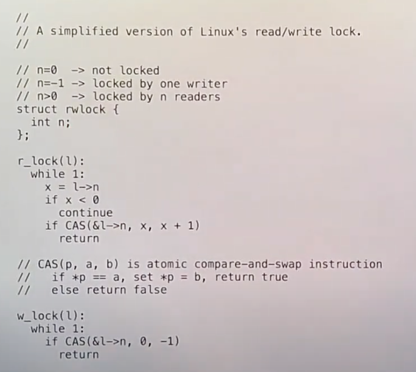

# RCU
## 锁的问题
锁带来的直接问题就是降低性能。
## 读写锁
读写锁比自旋锁稍微复杂一点。

读写锁允许多个读者获取读锁，读取可以并行执行。
也允许一个写者获取写锁。但是不可以两种情况都发生。

 

读锁需要空转，而且实际上读锁也对共享数据结构进行了写，也增加了cache相关的开销。

## 基本实现
要求: 读者不用锁。

rcu实现方式
如果有一条链表
```ascii
e1 ---> e2 --->e3
```

- rcu不允许写者直接修改链表数据，写者会创建新的copy,然后在copy中修改，最后替换回去。这样的实现可以让读者要么读到修改后的，要么读到修改前的。

```ascii
e1 ---> e2 ---> e3
                ^
                |
        e2'------
```

- 当替换时，我们希望替换是原子的，类似事务的提交。

## memory barrier
事实上cpu执行访存指令很多时候都不按顺序。
所以在我们需要保证顺序访存的代码中，必须使用barrier.

## 读写规则
旧的部分要等待所有读它的进程结束后再进行释放。


如何实现等待读进程完成呢？
- refcount
- 带gc语言实现

上述两种方法并不现实，因为refcount开销太大，os又不是gc语言实现的。


另一种方法
- 读者不能再RCU临界区出让cpu
- 写者在每一个CPU核都切换一次上下文(即最坏情况下的每一个cpu核上的RCU读操作都完成)后释放链表


`synchronize_rcu`等待后提交，之后释放

如果写者不想等待，可以使用`call_rcu`,传入想释放的对象和释放的函数，这样RCU系统会自动检测cpu核的上下文切换数,自动释放。

但是不推荐使用`call_rcu`，因为`call_rcu`的大量调用会导致参数的保存占用很大空间。


## rcu代码例子
```c
//reader
list reader;
rcu_read_lock();
e = head;
while(p){
  // 读取的代码
}
rcu_read_unlock();


//writer
acquire(lock);
old = head;
e = alloc();
e->x = abc;
e->next = head->next;
head = e;
release(lock);

synchronize_rcu();
free(old);
```

由于rcu无法限制多个写者，所以写者之间需要自旋锁来保证互斥


**使用rcu时，不可以返回指向共享数据的指针，因为在rcu之外对共享数据的修改是不被保护的**

## 总结
RCU并不会让写操作变快，相反写操作变得更慢了，但是读操作会变得很快。

直接应用RCU的数据结构必须支持单个操作的原子更新。

