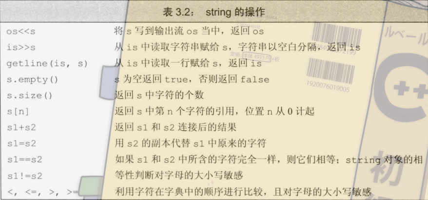
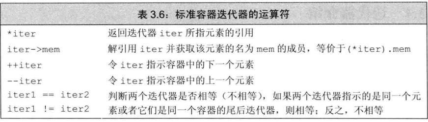
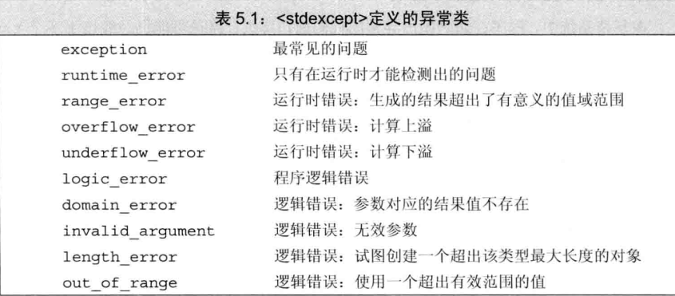

# cpp primer
## 第一章 开始
## 第二章 变量和基本类型
### 基本内置类型
1. c++ 并未规定char到底是signed还是unsigned,所以使用时最好明确的写出
2. 浮点数使用double和float的计算代价差距不大，可以用double就用double
3. 有符号数的溢出是未定义行为，尽可能避免这样的行为
4. 无符号数和有符号数进行运算时，会把有符号数当成无符号数来计算

### 字面值常量
1. 十进制字面值的类型是int long longlong中可以容纳字面值的最小类型
2. 八进制和十六进制字面值则是int uint long ulong以及longlong中可以容纳的最小类型
3. 十进制的字面值没有负值，-10仅仅是对10取负值
4. 注意字面值的前缀和后缀

### 变量
变量的初始化和赋值不是一个概念

列表初始化如果存在丢失信息的风险，则编译器会报错

- 定义变量是如果没初始化，那么变量会有一个默认值
  - 函数体之外的内置变量初值为0 应该是指全局变量和static这些
  - 函数体内的内置变量初值未定义
- 声明和定义
  - `extern int a = 0`就是定义声明
  - 声明不需要赋值，赋值就会覆盖掉extern的作用
- 作用域
  - 当函数内和全局有重名的变量，直接访问变量访问的是函数内的变量，而`::var`则是访问的全局作用域的变量
  
### 引用和指针
#### 引用
`int &ref = i;`引用是给一个变量起了另外一个名字，引用必须初始化，且无法改变他的指向
无法创建引用的引用，给变量赋值为引用，则变量值为引用的值

- 引用的初值必须是一个对象
- 引用的初值必须与其类型相匹配

#### 指针
- 指针不可以指向引用
- void *指针 不可以解引用

```cpp
int a= 10;
int &ra = a;
int *const pa = &a;
```
引用就类似于 `*const`

### const 
默认情况下 const对象只在文件内有效
如果想让const对象在文件间共享
需要在const的声明和定义处都加上extern

#### const引用
```cpp
const int ci = 0;
const int &rci = ci;
```
可以将引用绑到const变量上，但是这个引用是不可以改变变量值的,
因为引用就是对应变量的别名罢了。

##### const引用的例外
常量引用可以用任意表达式作为初始值，只要表达式可以被转换为对应的类型即可
```cpp
int i=42;
const int &r1 = i;
const int &r2 = 42;
const int &r3 = r1*2;
```
为什么会这样呢？
```cpp
double d = 3.1;
const int &ri = d;
```
这个也是合法的，编译器在中间一个`const int temp = d`的临时量，为了让ri可以绑定到d上。

**非常量引用是不可以绑定任意表达式的**，因为如果绑定到了临时量，那么对引用的修改就变成了对临时量的修改，而不是对源变量进行修改了

const引用可以引用非const对象


#### 指针和const
和引用类似,const type *无法改变所指向变量的值，但是可以改变指针的指向

常量指针可以指向非常量对象

#### *const
不可以改变指向，但是可以改变指向的值


**总结一下：指向常量的指针或引用可以指向非常量的变量**
指针相互赋值的时候要注意const的问题，普通的指针不可以用`const type *`去初始化，因为普通的指针可以修改指向的值，而指向常量的指针不可以修改对应值。

##### 顶层和底层const
`const int *const  p = &var;` 其中变量本身的是顶层`const`,指向的对象的是底层`const`
引用都属于顶层`const`不可以改变指向，`const int &a = b;`的const就是底层`const`,表示不能通过a改变b的值

#### constexpr 和常量表达式
常量表达式：值不会变，且在编译的过程就得到了结果的表达式，字面值就是常量表达式

用常量表达式初始化的const对象也是常量表达式
```cpp
const int max_files = 50;
int a = 27;
```
`max_files`就是常量表达式，而`a`由于不是const 所以不是。

`constexpr`类型就是来声明常量表达式的，这个关键字声明的变量会由编译器检查是否为常量表达式。
只要你认为他是常量表达式那就把他声明为`constexpr`

##### 字面值类型
constexpr指针初始化必须定义为`nullptr`或者`0`或者固定地址中的对象
(以后会讲到定义在函数外的对象地址是固定的，可以用来初始化constexpr指针)

### 处理类型
#### 类型的别名
`typedef double wages`,`wages`==`double`
`typedef double wages,*p`,`wages`==`double` ,`wages *`== `p`
注意以下的代码
```cpp
typedef double wages,*p;
p p1,p2;
wages *p3,p4;
```
其中p1 ,p2都是指针类型，而第二行p3是指针，p4是double类型的变量

#### auto
auto的变量必须有初值，编译器自行推断变量类型


新标准规定了新方法声明别名
`using wages = double`

##### 别名和常量
```cpp
typedef char *pstr;
const pstr cstr;
const pstr *ps;
```
其中`const`修饰的是新的类型`pstr`，`pstr`本身是指针类型，那么`cstr`就是一个`pstr`类型的常量，`pstr`又是个指向char的指针，因此指向不可以变但是指向的值可以变
而`ps`则是指向pstr对象的指针，`const`修饰的是`pstr`,所以`ps`值本身也就是指向不可以变。是一个指针常量，指向可以变，但是指向的值不可以变


##### auto 与 const

用`auto`定义变量时，auto会忽略顶层`const`而保留底层`const`
```cpp
const int a = 8;
auto b = a; // b就是int 类型
const int *const c = &a;
auto d = c; // d就是 const int *类型的  
```

如果希望auto是一个顶层const,需要明确声明const
`const auto f = ci;`


当`auto`定义引用的时候，顶层的`const`会被保留


**在定义变量的时候 `&`和`*`仅仅是属于某个声明符号，而非基本数据类型，所以只要变量的去掉声明符号数据类型一致就可以在一行里定义**

#### decltype
`decltype`可以得到表达式的类型
如果想从表达式推断出要定义变量的类型却又不想将变量初值初始化为表达式的值，则可以使用`decltype`

```cpp
decltype(f()) sum = x;
```
sum的数据类型就为f函数的返回值类型

对于顶层`const`和引用，decltype是这样的
- `decltype(var)`如果var是引用的话，新的变量也得是引用，也就必须赋初值
- 引用是对象的别名，除了在decltype这里被当作数据类型
- `decltype(*var)`当内部有解引用操作，则返回类型为引用类型
- `decltype((var))`的结果是引用，而单括号就是var本身的类型


**赋值语句的类型是引用**

### 自定义结构
类内可以设初值
```cpp
struct example{
  int id = 0,
  std::string s,
  double salary = 0.0;
};
```


## 第三章 字符串，向量和数组
`using std::cout;`

头文件不应该包含using声明

### 字符串 string
```cpp
string s1;
string s2=s1;
string s3("xxxx");
string s4(n,'c');
```

#### 直接初始化和拷贝初始化
`=`初始属于拷贝初始化，编译器将右侧的值拷贝到新的对象中
而`string a("value")`则属于直接初始化


#### string对象的操作


`cin>>s;`会跳过空白字符，且遇到空白字符就停止。

如果希望保留空白字符，可以使用`getline(is,string)`


值得注意的是`string.size()`返回的是一个`size_type`类型的变量,无符号。

##### string的加法

`string a = "a "+b`
需要注意的是，string加法虽然可以实现string与string以及string与字面值相加，但是string与字面值相加有一个条件，那就是`字面值两侧必须有一个string对象`

##### string中的字符
可以通过下标索引得到
`s[n] = '4';`


### vector
vector是模板而非类型，`vector<int>`才是类型

#### vector的初始化
```cpp
vector<int> a;
vector<int> b(a);
vector<int> c= a;
```
后两个初始化都是拷贝过去的

##### 列表初始化
`=`拷贝初始化时，只能提供一个初始值
提供的初始元素值的列表只能放在大括号里而非小括号里
```cpp
vector<string> v1{"a","abc","abcd"};
vector<string> v1("a","abc","abcd"); //非法
```


vector内对象的初值是由类型决定的，int就是0,如果是对象就由对应类决定

列表初始值还是元素数量
```cpp
vector<int> v1(10);
vector<int> v2(10,1);
vector<int> v3{10};
vector<int> v4{10,1};
```
用大括号表示的是初始值列表，而括号则表示个数以及初值

```cpp
vector<string> v1{"hi"};
vector<string> v2{10};
vector<string> v3{10,"hi"};
```
v2 v3由于10并不是string类型的，所以编译器不使用，列表初始化， 会使用括号的方式初始化

##### tips
1. vector对象可以在运行时高效的添加，除了元素都一样的情况，其他情况先建一个空的vector然后运行时添加即可
2. vector动态的添加内容时，不能用范围for循环，意思就是for循环内不应该改变遍历序列的大小

##### 3.18
段错误

##### 3.19
```cpp
vector<int> v1(10,42);
vector<int> v2; //for循环添加
vector<int> v1{42,.......42};  //列表初始化
```


### 迭代器
`auto i = vec.begin()`,i指向第一个位置
`auto i =vec.end()`,i指向最后一个位置的后一个位置
如果容器为空，则begin和end返回的是同一个迭代器



**解引用非法迭代器和尾后迭代器都是未定义行为**


#### 常量迭代器
`auto i = v.cbegin()`
`auto i = v.cend()`

#### tips
1. 使用了迭代器循环体都不要向迭代器所属的容器添加元素
2. 迭代器只能相减不可以相加


### 数组
数组的元素个数必须在编译时就确定，也就是说必须是一个常量表达式
**不存在元素为引用的数组**

```cpp
int *p[10];     //数组元素为10个指针
int (*p)[10];   // p 是指向int[10]的指针
int (&p)[10]=arr;   //p 是一个int[10]数组的引用
int *(&p)[10]=parr; //p 是一个有10个指针元素的数组的引用
```

在分析复杂声明时可以采用由内到外的方式分析
#### 数组和指针
很多时候编译器会自动的将数组名转换为数组首地址

可以通过`begin(array_name)`和`end(array_name)`去获取数组的开头和结尾处的指针，这里的结尾与迭代器类似 

#### cstyle string
尽量少用
1. string类型相比较可以比较出字符串大小，而char *比较的结果是指针大小，无意义
2. 由于c style string的函数通常需要预先设置分配好空间，安全风险高，所以尽量用string


#### cstring和string之间的接口
1. 可以使用空字符结束的字符数组来初始化string对象或为其赋值
2. 在string的加法运算中允许以空字符结束的字符数组作为其中一个运算对象,复合赋值运算中允许使用以空格结束的字符数组作为右侧的运算对象
3. `const char *p = str.c_str();`
4. 无法保证`c_str()`返回的数组一直有效，所以在这之前最好拷贝一份str
5. 尽量少用数组，多用vector和string

### 多维数组
c++中其实没有多维数组，我们所说的多维数组其实是数组的数组
```cpp
int a[3][4];
for(auto &row:a){
  for(auto col:row){
    cout<<col;
  }
}
```
可以通过foreach来遍历数组,注意外围的循环必须是引用类型，如果没有`&`符号，则row会因为a退化为指针也为指针类型，指针类型无法遍历


## 第四章 表达式

运算符重载：比如cout<<等，运算对象和返回值的类型是运算符定义的，但是运算对象的个数以及运算的优先级和结合律都是无法改变的。

左值和右值：左值表达式的结果是一个对象或者函数，常量对象为代表的一些左值实际上不能作为赋值语句左侧的运算对象。而且有一些表达式的结果是对象，但是他们是右值而非左值。
左值：内存中的位置
右值：内存中的内容

不同的运算符对运算对象的要求不同，返回值也不同
1. 赋值运算符需要左值在左侧
2. 去地址作用于一个左值运算对象，返回一个指针，指针为右值
3. 解引用，下标，迭代器解引用，string和vector下标的结果都是左值
4. 内置类型和迭代器的`++--`作用于左值对象，运算符前置1的结果也是左值
5. decltype内的表达式结果为左值，那么decltype结果为引用
   
#### 求值顺序
`int i =f1()*f2();`,虽然优先级规定了运算对象的组合方式，但是没有说明运算对象按什么顺序求值，也就是f1和f2的求值顺序是不确定的
比如`<<`运算符没有规定运算对象的求值时间，则
`cout<<i<<" "<<++i;`的结果是不确定的


**在遍历对象时，可以使用引用以便节省空间**


1. 除非必须，否则不使用后置版本的自增运算符
2. sizeof对string和vector的结果只是类型的固定大小，不会计算对象中的元素所占空间


#### 隐式转换

小类型转换成大类型
char运算时会转成int,之后在转换回去


```cpp
int ia[10];
int *ip = ia;
```

1. 0和nullptr可以转换成任意类型的指针，指向非常量的指针可以转为void*，指向任意对象的指针可以转为const void *
2. 允许将指向的非常量的指针转换为指向常量的，引用也可以。

#### 显式转换
1. 类型强转：有`static_cast`,`dynamic_cast`,`const_cast`和`reinterpret_cast`,
  - static_cast: 只要不包含底层const就可以用static_cast来转换 `double *p = static_cast<double*>p;`,**如果指针类型不是指针所指的类型，则会出现未定义后果**
  - const_cast：只改变运算对象的底层const,不改变指针类型，可以通过该转换去掉底层const,如果指向的对象本身就是常量，通过const_cast得到写权限后更改变量值是未定义行为而
  - reinterpret_cast: 可以更改指针的类型，比如将int指针改变为char指针


## 第五章 语句
### trycatch
```cpp
try{
  ;
}catch(excep){
  ;
}
```
### 标准异常



## 第六章 函数
### 函数基础
实参的求值顺序是不确定的，所以尽量避免在传参时对多个参数传入改变同一个变量的表达式

在c++中，尽量使用引用传参代替指针传参,而且引用传参可以避免值传递的拷贝开销
```cpp
void swap(int &a, int &b)
{
    int temp = a;
    a = b;
    b = temp;
}
```

如果我们想要通过函数返回多个值，则可以通过传入引用修改参数的方式

#### const形参和实参
尽量把不会修改的参数定义为const引用

**不可以用`int*`初始化`const int*`**
**非常量初始化需要左值**


#### 含有可变参数的函数
当参数类型相同的时候可以使用`initializer_list`这个标准哭类型

就是直接传一个列表，不稀奇

#### 引用返回左值
返回引用的函数的返回值是左值

列表初始化也返回左值


#### 声明一个返回数组指针的函数
`int (*func(int i)) [10];`
func是一个函数指针，函数返回一个指针，这个指针的类型是`int[10]`的

#### 尾置返回类型
`auto func(int i)->int(*)[10];`
该声明和前面的那个是一个意思

#### 使用decltype来确定返回类型
```cpp
int a[10];
decltype(a) *func(int i){
  ;
}
```


### 函数重载
在同一个作用域内，且**参数列表**不同单重名的函数被称为重载函数

顶层const不会影响函数的参数
而参数如果是指针或者引用，底层const会影响参数的类型.
**注意指针和引用的const在前面是底层const,后面是顶层const**
```cpp
void exam(const string &);
void exam(string &);
```


### 特殊用途 语言特性
#### 默认实参
```cpp
void exam(int a=7,int b=6);
void exam(int a,int b){
  ;
}
```
默认实参既可以在定义时指出，也可以在声明时指出


#### inline函数
inline可以向编译器建议该函数在代码中展开，但仅仅是建议
内敛函数通常仅仅只包括一个return


#### constexpr函数
能用于常量表达式的函数
返回值以及形参必须是字面类型，且函数体必须只有一条return语句
1. 函数体内可以有其他语句，但是要保证运行时不执行任何操作，比如可以有空语句，using声明，typedef等

内敛函数和constexpr函数的定义也通常放在头文件中


#### 调试帮助
assert预处理宏
`assert(expr)`,如果expr为假则assert输出信息并终止程序。

如果定义了`NDEBUG`则assert什么也不做

我们也可以利用`NDEBUG`写出一些调试代码
```cpp
void print(){
#ifndef NDEBUG
  ceer << __fun__ << endl;
#endif 
}
```
上述例子可以在NDEBUG未定的时候输出函数的名字

c++编译器定义了一些对调试很有用的变量
1. `__func__`
2. `__LINE__`
3. `__TIME__`
4. `__DATE__`
5. `__FILE__`


### 函数匹配
通过转换也可以算作匹配
比如`void foo(int)`函数可以匹配`foo(1.0)`

#### 实参类型转换
1. 精确匹配：实参和形参类型相同，实参是数组类或函数类转换为对应的指针类，实参顶层const的删除或添加
2. 通过const转换实现的匹配
3. 类型提升实现的匹配
4. 算数类型转换或指针转换
5. 类类型转换实现的匹配


#### 类型提升和算数类型转换的匹配
函数调用前，小整形一般会提升到int类型或是更大的整数类型
比如`wwt(short)`和`wwt(int)`,当传入char类型时，可能会类型提升选择`wwt(int)`来执行


### 函数指针
```cpp
bool (*pf)(const string &,const string &);
```
pf是指向一个函数的指针

当我们使用函数名作为右值时，函数名自动转为指针,也可以通过取地址符获得指针
`pf = &foo`
在调用函数指针时有几种方法
```cpp
pf(para1,para2);
(*pf)(para1,para2);
```

指向不同函数类型的指针间不存在转换规则，但是可以为他们赋值nullptr

重载函数的指针的类型必须精确匹配重载函数中的某一个。

#### 函数指针作为形参
```cpp
void bigger(int a,int b,bool comp(const int &,const int &));
void bigger(int a,int b,bool (*comp)(const int &,const int &));
```
上述两种都可以表示函数指针。


#### 函数指针作为返回值
可以使用using给函数指针类型起别名
`using F = int(*)(int);`
也可以直接声明
`int (*F(int))(int);` F是一个参数为int的函数指针，这个函数的返回值是一个参数为int,返回值也为int的函数指针。
也可以使用尾置返回类型
`auto F(int)->int(*)(int);`

#### 函数指针与auto和decltype
decltype对于函数的结果返回的也是函数，所以要得到函数指针需要显式的声明一个`*`
`decltype(foo) *pf;`


## 第七章 类
const成员函数：`std::string isbn() const{return bookNo}`,表示函数中的this是一个指向常量对象的指针,如果没有`const`,`this`代表的是`classname *const this;`无法指向常量对象，因此常量对象只能调用常量成员函数,

返回this的函数,可以返回调用该函数的对象指针
```cpp
wwt& wwt::returnthis(){
  return *this;
}
```

**IO类等某些类不支持拷贝,所以在函数中如果需要io类只能以引用的方式传递，且函数中会修改流的内容，所以不可以是const的引用**

### 构造函数
默认构造函数，只有当类没有声明其他构造函数的时候才会有默认的构造函数
或者类中有其他类的变量，且这个变量所在类没有默认构造，则编译器也不能为该类生成默认构造
```cpp
class Person{
  Person() = default;
  Person(const string &name):name(name){ }
}
```
其中`:name(name)`是成员变量初始化的一种方式

### 拷贝赋值和析构函数
编译器会帮我们实现这些东西，但是许多类不可以以来编译器实现的版本

### class 和 struct
仅仅是默认的访问权限不同。

### 友元函数
```cpp
class Person{
  friend void foo();
}
```
foo函数可以访问Person内部private的变量或函数

### 其他类型的类成员
`typedef std::string:size_type pos;`
对类型的别名也存在访问限制，也就是public和private之分

#### 可变数据类型
如果我们想修改const对象内的某些变量，可以用`mutable`声明

### 返回*this的函数
```cpp
Person &foo(){
  return *this;
}
Person &bar() const {
  return *this;
}
```
foo函数返回的是普通的引用，而bar函数返回的是常量引用

```cpp
Person &print(cout){
  do_print(cout);
  return *this;
}
Person &print(cout) const{
  do_print(cout);
  return *this;
}
Person &do_print(cout) const;
```
上述样例展示了const和非const成员函数重载的情况，非const的print之后还可以类似链式的调用其他成员函数，而const print就不可以了，因为返回的是const 引用


### 友元再探
类之间也可以是朋友
`friend class name;`


**友元声明影响的是访问权限，友元声明不像函数声明，如果没有函数声明只有友元声明，相当于函数没有声明过**

### 类的作用域
寻找声明的过程：
1. 类外：在名字所在块内寻找声明，只考虑名字使用前的声明,没找到就去本块的外层寻找
2. 类内：先编译成员的声明，知道类可见后才编译函数

因此类内函数的声明可以使用类内定义的任何名字

**如果类内使用了某个外部作用于的名字，则内部不可以重新定义该名字**

### 构造再探
如果类中有引用或者const变量，则需要在构造中赋初值。

`X(int val):j(val),i(j){}`,初始化列表只说明了初始化的值，而不规定顺序。所以尽量不要用一个成员给另一个成员初始化，初始化顺序最好和成员的声明顺序相同。


### 委托构造函数
该构造函数把任务委托给了其他构造函数
```cpp
class Test{
  //..
  Test():Test(para1,para2,para3){...}
}
```
该`Test()`委托给了`Test(para123)`后再执行函数体内的语句


### 隐式的类类型转换
```cpp
class P{
public:
  string name;
  P(string name):name(name){}
  void combine(P &item){
    ..
  }
}
string a= "wwt";
P wwt;
wwt.combine(a);
```
上述例子中可以将string a转换为P类型的对象，因为P存在一个只需要string的构造函数

只允许一步类型转换
比如`wwt.combine("wwt")`就是错误的，因为他经过了两次转换，一次是从`"wwt"`转为string
生成的临时对象最终会被丢弃。

#### 抑制构造函数的隐式转换
在构造函数前加`explicit`

#### explicit构造函数只能用于初始化
#### 使用构造进行显式转换
```cpp
b.combine(B(name));
b.combine(static_cast<B>(name));
```


**临时变量可以当作右值，或左值的常量引用**


### 聚合类
类似c的结构体，只有数据没有函数，全部都是public

### 字面值常量类
不是聚合类的话必须满足下面的要求才是字面值常量类

1. 成员变量都是字面值
2. 类必须有一个constexpr构造函数
3. 类内成员初值必须是constexpr,如果成员是对象，则必须使用constexpr的构造函数初始化
4. 必须使用默认的析构函数


### 静态成员
每个类共享一个

因为静态成员不存放在类内,所以一般我们在类外进行定义以及初始化静态成员，当然也可以在类内

类的静态成员不应在类内初始化，但我们可以为其提供const指数类型的类内初值，要求是静态成员必须是constexpr类型

即使常量静态成员在类内被初始化了，我们也要在类外定义一下该成员

静态成员可以是不完全类型
```cpp
class A{
  static A a; //合法，静态成员可以是不完全类型
  A *b; //指针也可以是不完全类型
  A c; //成员必须是完全类型
}
```


静态成员可以作为默认实参，而非静态成员不可以
```cpp
class Screen{
  Screen &clear(char = bkground);
  static const char bkground;
}
```
