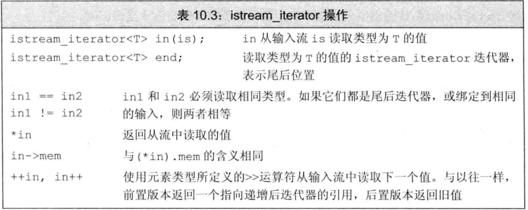
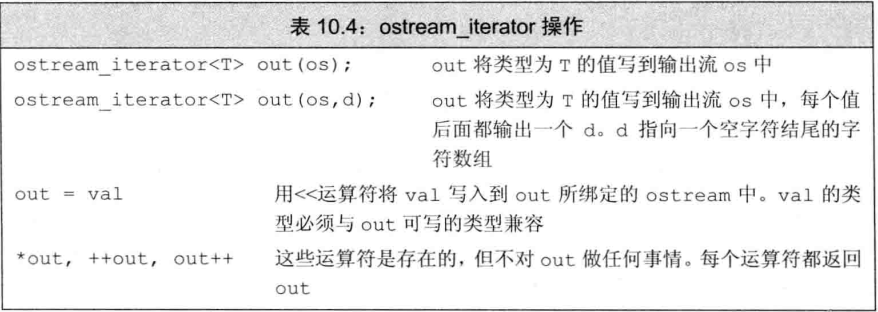

# 泛型
迭代器使得算法不依赖于容器，仅仅需要元素拥有算法所需的操作即可。

## 泛型算法
通常都是指定范围然后进行某些操作，所以前两个参数一般都是两个迭代器。
### 只读算法

`accumulate(vec.begin(),vec.end(),0)`是指将`vec`中元素求和，初始值是0，第三个参数决定了和的初值以及类型。

`equal(v1.begin(),v1,end(),v2.begin())`,比较两个序列是否保存相同的值。

注意`equal`使用的是`==`来比较元素，因此如果元素是`c`字符串则比较的结果没有意义。


### 写容器的算法
`fill(begin,end,value)`将范围内的元素重置为`value`
`fill_n(iter,n,value)`将`iter`处开始的`n`个元素，重置为`value`


`back_inserter`:插入迭代器可以保证容器有足够空间存储输出数据,他接收容器引用，返回一个迭代器，当这个迭代器被赋值时，会调用`push_back`来添加元素。

```cpp
vector<int> vec;
auto it = back_inserter(vec);
*it = 42; 
// 实际调用push_back来写入
fill_n(it,10,0);
// 同样调用push_back
```

拷贝算法:
`copy(a_begin,a_end,b_begin)`接收三个迭代器，将序列`a`的内容复制到序列`b`的指定位置中，返回`b`复制元素的后一个位置。

`replace(begin,end,old,new)`将区间中所有值为`old`的元素都改为`new`
`replace_copy(a_begin,a_end,b_iter,old,new)` 将不会修改`a`序列，会复制`a`的拷贝到`b`，然后根据`old`进行修改


### 重排算法
`sort(begin,end)`可以按顺序重排序列
`unique(begin,end)`会把重复的元素"删除",其实并非删除，而是被后面的元素给覆盖掉了。最终返回不重复序列末尾的下一个位置的迭代器。


## 定制操作
类似`c`的`qsort`，我们可以向`sort`等算法传递一个函数来实现某种操作。
被传递的函数被称为**谓词,`predicate`**,是一个可以调用的表达式。

标准库中可以接受的只有一元和二元谓语，表达能力可能不够，因此我们需要一些语言特性来实现其他功能。


## lambda
可以理解为一个匿名函数，大致格式如下
`[capture list](parameter list)->return type { func body }`
`capture list`是一个定义`lambda`中局部变量的列表，一般为空。

可以省略参数列表和返回值类型，但是必须保留捕获列表和函数体。
除了函数体只有一句`return`的`lambda`返回值有类型，其他没写返回值类型的都是`void`

```cpp
[](const string &a,const string &b)->bool{
  return a.size() < b.size();
}
```
`lambda`应该可以使用本块作,用域内的变量，只是需要在捕获列表中声明`lambda`里要使用的变量，比如
```cpp
[sz](const string &a)->bool{
  return a.size()>sz;
}
```


`find_if(begin,end,lambda)`返回第一个`lambda`为`true`的位置的迭代器
`for_each(begin,end,lambda)`对范围内每一个元素执行`lambda` 


### lambda捕获和返回

定义`lambda`时，编译器会生成一个对应的新的未命名的类和类实例，这个类包含了`lambda`捕获的变量。
捕获的变量分为值捕获和引用捕获:
- 值捕获仅仅在捕获时拷贝变量值，后续变量的改变不会修改`lambda`内捕获的值
- 引用捕获，则后续对变量的修改会影响到对应的`lambda`，且必须保证对应的对象要在使用时依旧存在


隐式捕获,让编译器推断捕获列表,`=`代表值捕获，`&`为引用捕获。
```cpp
[=](const string &a)->bool{
  return a.size()>sz;
}
```

混合使用捕获
```cpp
[&,c]{return os << c;}
```
混合使用时捕获列表必须以`=`或`&`开头来代表隐式捕获的方式，且如果隐式捕获的是`=`，则后面显式捕获只能捕获`&` 反之亦然。


#### 可变lambda
`lambda`捕获的值是不可以改变的，如果我们想改变捕获的变量，需要添加`mutable`
`[v1]()mutable{ return ++v1;}`
 

捕获的局部变量会一直保存在`lambda`的对象中，如果`mutable`的话也可以被修改。

### 参数绑定
`bind(func,param1, p2, std::placeholder::_n,p3)`
`bind`可以为函数固定某些参数，`_n`被称为占位符
```cpp
auto g = bind(f,a,b,c,_2,_1);
g(p1,p2);
// 等价于
bind(a,b,c,p2,p1);
```
`_n`代表了参数在返回对象的位置是第几个,因此可以借助占位符来重排列参数的顺序。
参数绑定也可以绑定引用，比如传入参数是输出流时，无法进行拷贝。
**参数绑定引用时，必须使用`ref(param)`来获取引用，否则你会得到千行乱七八糟的报错**


## 再谈迭代器
标准库还定义了一些其他的迭代器
### 插入迭代器
`back_inserter` `front_inserter` 和`inserter`,前两个就是调用`push_back`和`push_front`，第三个则会在指定的位置前面的位置插入
### 流迭代器
`istream_iterator`,`ostream_iterator`。 `istream_iterator<string> str_it(cin);`就可以从输入读取`string`

值得一提的是，空的流迭代器是可以当作尾后迭代器使用的。


`istream_iterator`可以懒惰求值，并不保证立即读取数据，直到解引用等迭代器操作时才会读取数据。

以下是两个流迭代器的操作:
 
 


### 反向迭代器

反向迭代器的使用需注意反向，当我们通过反向迭代器确定了一个位置时，可以使用`reverse_iterator`来返回该位置的普通迭代器，这样打印之类的操作就不会反向了。

##  泛型算法
泛型算法将迭代器分为5类
- 输入迭代器，只读不写，单次扫描，只能递增
- 输出迭代器，只写不读，单次扫描，只能递增
- 前向迭代器，可以读写，多次扫描，只能递增
- 双向迭代器，可以读写，多次扫描，递增递减
- 随机迭代器，可以读写，多次扫描，支持所有迭代器运算

### list和forward_list特有操作
`splice` `merge` `remove` `reverse` `sort`.


