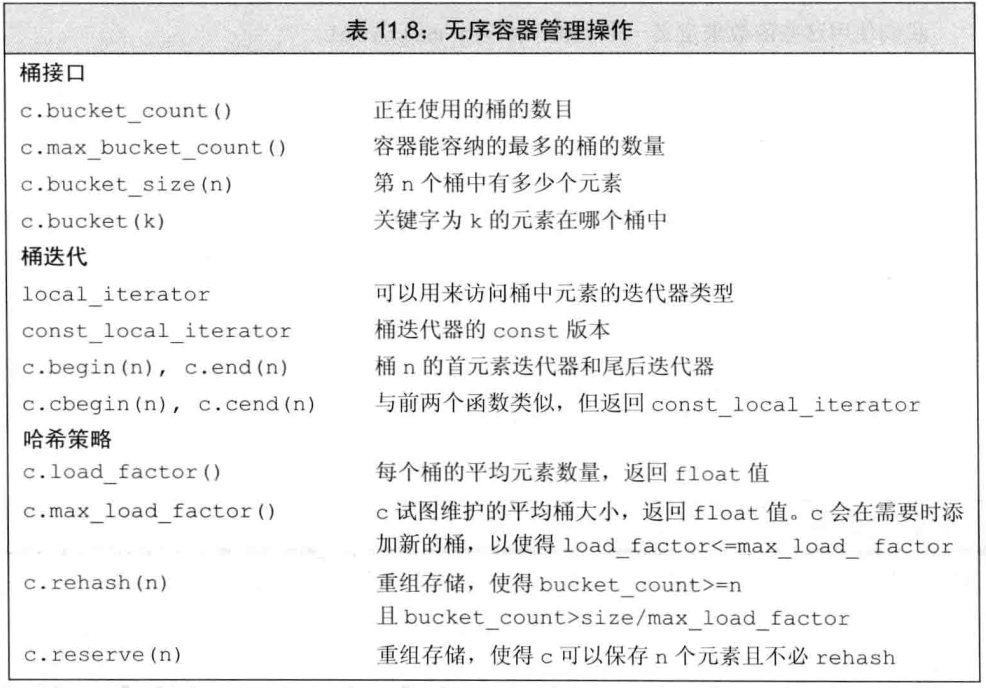

# 关联容器
就是按照关键字检索内容的容器
`map` `set` `multimap` `multiset`

## 有序容器
### 关键字
关键字类型必须定义元素的比较方法，例如`map`中的`key`类型必须可以比较。
比较操作必须实现的是严格弱序，即小于等于

`multiset<Person,decltype(cmp) *> school(cmp); ` 使用了自定义的操作来实现比较。

### pair类型
顾名思义，就是`pair<T1,T2> p{v1,v2}`,类似容器，元素为`first`和`second`。

## 关联容器操作

在关联容器中，定义了`key_type` `value_type`,`map`还定义了`mapped_type`这种类型.
**在`set`中`key`和`value`都是指的元素类型，而`map`中`key_type`对应的是`key`，`value_type`对应的则是整个`pair`，`mapped_type`才对应`value`**

### 关联容器迭代器
解引用关联容器的迭代器会得到`value_type`的引用，对`map`而言得到的是`pair`类型的对象。

`set`的迭代器是`const`的，因此不可以改变`set`内的元素值。

通常情况下不会对关联容器使用泛型算法。因此必要时可以拷贝到顺序容器然后再使用算法，或者对顺序容器使用泛型算法后，利用`inserter`插入到关联容器的某个位置。

### 添加元素
有序的关联容器利用`inserter`等方式插入元素时会自动进行排序。

向`set`添加元素:`set1.insert({....})`.
向`map`添加元素:`mp.insert({key1,value1})`,可以使用大括号来初始化一个匿名的`pair`,返回一个`pair`里面是一个迭代器和`bool`值，分别是插入后的位置(已有的话就不插入了，直接返回对应元素位置)，和插入是否成功的指示。

### 删除元素
`erase`可以删除元素，我们可以传入一个迭代器或者一对迭代器删除指定元素，返回删除后原位置的迭代器。也可以传入一个`key_type`的值，删除所有与其相等的元素，返回删除元素的个数

### map的下标操作
`map`和`unordered_map`提供了下标操作和`at`函数，对下标操作可能会插入元素，因此不能对`const`的`map`进行操作.
`at`带参数检查，如果元素不存在与容器中，则会抛出异常。

**下标操作和解引用操作在`map`中返回的值不一样，下标返回`mapped_type`，而解引用则返回`value_type`，即`pair`**

### 访问元素
`find(target)`返回指向目标的迭代器,找不到则指向`end`
`count(target)`返回target出现的次数
`lower_bound` `upper_bound` 返回第一个不小于或不大于参数的元素迭代器,不适用于无序容器,前者正着找，返回第一个的迭代器，后者倒着找，返回倒着第一个后面一个位置的迭代器
`equal_range(k)` 返回一个迭代器`pair`，表示关键字等于`target`的元素的范围，没有则两个迭代器都指向`end`

由于下标可以添加元素，所以在此之前我们有必要使用`find`来检查容器内是否有该元素.
对于`multi`的容器来说，我们可以使用其他的方式来查找元素，`find`找到元素开始的迭代器，`count`得出个数，然后从迭代器开始向后查找对应个数即可(`multi`容器关键字相同的元素相邻)

对于上面的问题我们也可以使用`upper_bound`和`lower_bound`来解决，两个函数返回的迭代器组成一个区间，在此区间遍历即可

但其实使用`equal_range`是最直接的，直接返回一对儿迭代器，然后在区间内进行遍历即可

**`upper_bound`和`lower_bound`在没找到对应的元素的时候，返回的迭代器位置是一样的**

## 无序容器
该容器元素不会比较元素，而是使用哈希函数和关键字类型的`==`来组织元素

无序容器使用哈希和桶，每一个桶可以保存多个元素，通过哈希函数将元素映射到桶

无序容器的操作
 

无序容器提供了一组管理桶的函数，可以查询容器状态以及对容器进行`rehash`等。

默认情况下，无序容器需要使用`==`来进行元素的比较。可以使用`hash<key_type`来获取元素的哈希值。标准库为内置类型和`string`以及智能指针定义了`hash`。对于其他自定义类型，我们需要提供自己的`hash`模板。

当然也可以不使用默认的`hash`，也可以实现自己的哈希函数和比较函数代替`==`和`hash`模板。

`unordered_multiset<Sales_data,decltype(myhash) *,decltype(myequal) *> bookstore(42,myhash,myequal);`
上面代码实现了自定义的`hash`函数和代替`==`的函数。

