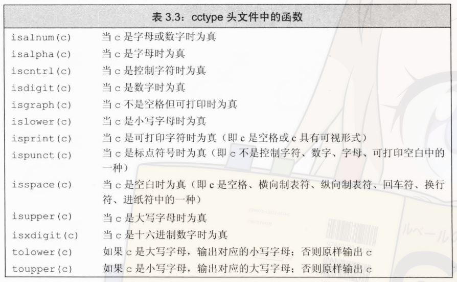

# 字符串 向量和数组
## 命名空间 
## string
### string初始化
```c
string a;         // 空字符串
string b = a;     // b是a的拷贝而来的
string c = "abc"; // 同样是拷贝来的
string d(10,'c'); // 10个c
```

初始化的方式还有一些，比如
- `string s2("bcdeas")`


#### 直接初始化和拷贝初始化
拷贝初始化使用的是`=`，而直接初始化使用的是`()`。
拷贝初始化实际上执行的是两条指令:
```c
string temp = "string";
string var2(temp);
```
### string之上的操作
看下面的图吧
 


`cin>>str;`时注意会跳过前面的所有空格，并且在之后的第一个空格处结束。

`str.size()`可以返回字符串的长度，类型为`string::size_type`


#### 字符串的比较
类似`strcmp`.

#### 字符串相加

`string s4 = s1 + "asdfasd";`
注意不能两个字面值进行相加，`string`类型才能和字面值相加
`string s5 = s4 + "a" +" b";`合法，因为`s4`和`a`相加后还是`string类型`
`string s6 = "a" + "b" +s5;`不合法，因为先运算的`a`和`b`都是字面值

**为了与c兼容，所以c++中的字面值字符串不是`string`类型的**

### 处理string中的字符
api太多，见下图
 


遍历字符串字符:
```c
for(auto c:str1){
  // 处理字符
}
```
上述代码将`str1`的每一个字符拷贝给`c`

想要修改字符串就需要使用引用
```c
for(auto &c:str1){
  // 修改字符
}
```


可以通过下标索引字符串的字符，类似数组的操作，越界操作是`未定义行为`.
**下标运算符返回的是字符的引用**


## vector
`vector`是模板而非类型,编译器根据模板`vector`来生成对应的类型。

`vector`可以容纳大部分类型，但是引用不是对象所以没有包含引用的`vector`


### 初始化

```c
vector<T> v1;                   // 空的vector 默认初始化
vector<T> v2(v1);               // 拷贝v1
vector<T> v3 = v2;              // 拷贝v2 等于 上面的圆括号初始化
vector<T> v4(n,val);            
vector<T> v5(n);
vector<T> v6{val1,val2};
vector<T> v6 = {val1,val2};
```

初始化的三个例外:
1. 拷贝初始化即赋值时，只能提供一个初值
2. 类内初始值只能用拷贝初始化或者花括号初始化
3. 初始元素值列表只能用花括号。


创建`vector`时也可以省去初值，比如`vector<string> str(10);`,此时就会进行默认初始化。但是有些类必须明确提供初值，这样就不能进行上述操作了。


圆括号内的参数使用来构造对象的，而花括号则使用来列表初始化的。

当花括号内的参数不能用来初始化指定的对象时，就会采用构造的方式了。
`vector<string> str{10,"6"};`

### 其他操作
与字符串类似，`vector`的下标操作返回的是对应元素的引用


## 迭代器
所有标准库容器都可以使用迭代器，但是标准库容器中只有少部分能使用下标，因此迭代器是更通用的方法。

迭代器提供了类似指针的访问容器内元素的方法。

用法如下
```c
for(auto a = v.begin();a != v.end();++a){
  a->mem = abc;
}
```


### 迭代器类型
迭代器也分`const`和非`const`的例如`string`的迭代器有`string::iterator`和`string::const_iterator`两种

为了方便使用`const`的迭代器，C11中引入了`cbegin`和`cend`两个函数。

如果在循环内添加删除元素,就不要在循环内使用迭代器。


### 迭代器运算
对迭代器的加减就是移动迭代器前后对应个数。

迭代器之间的差为迭代器间的距离，类型是`difference_type`,有符号数。


## 数组
性能比`vector`好，但是不能扩容，灵活性差。

数组的大小要在编译时就确定，所以必须写入`constexpr`，当然新的标准支持了`vla`，不需要这个条件也行。(不知道为啥我在本机上编译`int a[foo()];`也可以通过，明明已经添加了`-std=c++11`)
字符数组初始化时，如果是单个字符进行的初始化，表示字符串时需要显式的写出`'\0'`。
如果是字符串字面值进行的初始化则不需要写。

**牢记需要初始化，因为函数内部的内置变量不初始化，其值是随机的**

#### 复杂数组声明
```c
int *ptr[10];
int (*ptr1)[10];      // 指向int[10]的指针
int (&ref)[10];       // 对int[10]的引用
int *(&ref)[10];      // 对int*[10]的引用
```


**如果`ia`是一个10个`int`数组,`auto ib = ia`得到的是一个指针，而`decltype(ia)`得到的则是`int[10]`这个类型。

为了让数组访问类似迭代器，c++11添加了两个函数`begin`和`end`

```c
int ia[10];
int *beg = begin(ia);
int *last = end(ia);
```
我们可以轻松的获取起始位置和尾指针的下一个位置。


#### 与c字符串的兼容
在任何出现字符串字面值的地方都可以用c风格的字符串来代替。

`string`提供了一个`c_str`的方法用于返回该字符串的字符数组，但是该字符数组不会一直有效，如果需要后续使用最好进行一次拷贝。

#### 数组初始化vector
```c
int arr[] = {1,2,3,4,5};
vector<int> vec(begin(arr),end(arr)); // 实际上是指针操作
vector<int> vec(arr+1,arr+3); // 因此也可以这样
```


### 多维数组

`int a[10][20][30]`实际上可以这样解释，`a`是一个有10个元素的数组，每个元素是一个有20个元素的数组，这20个元素每一个又是`int[30]`类型的。
因此我们可以这样遍历数组
```c
for(int (&b)[20][30]:a){
  // 继续使用for
}
```


使用范围`for`和`auto`时带引用的原因是因为不带引用的话，如以下的代码,编译无法通过，因为第一层`for`要遍历的元素实际上是`int[3]`类型的，但是由于b不是引用，`int[3]`退化成了指针，所以要遍历`b`中元素时，就会出错，因为无法遍历指针。

```c
int arr[2][3];
for(auto b:arr){
  // 继续使用for
  for(auto c:b){
  }
}
```

**因此如果使用范围`for`处理多维数组，除了最内层的`for`，其他都要使用引用**

