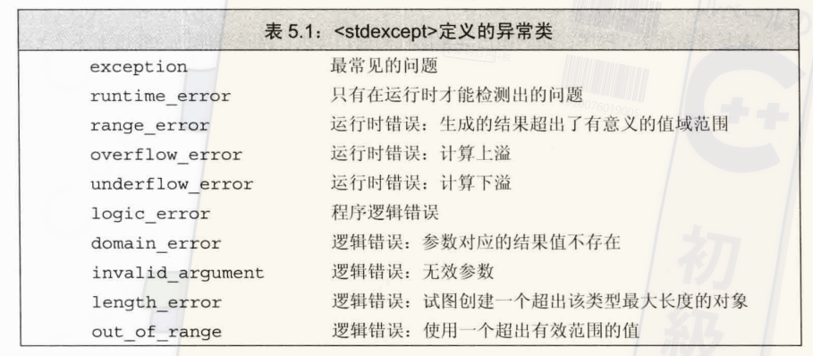

# 语句

## 范围for
```c
for(declare:expr){

}
```
`expr`必须代表一个序列，特点是支持迭代器

## try和异常处理
在函数执行中可能会遇到一些问题，为了功能解耦以及其他原因，可以在遇到问题时抛出异常，以供调用方处理
`throw runtime_error(str1);`

`try`语句块则是用来捕获异常进行处理的。
```c
try{
  // statement
}catch(excep1){

}catch(excep2){

}
```

## 标准异常
`exception`头文件中只定义了最基本的异常类，没有额外信息
`stdexcept`中定义了常用的异常类，如下图


 


`new`头中定义了`bad_alloc`异常类型
`type_info`定义了`bad_cast`异常类型

`exception` `bad_alloc` `bad_cast`都只能默认初始化，而其他的异常类型可以用一个字符串初始化

异常类型只定义了一个名为`what`的函数，函数返回一个`c`风格的字符串，提供一些异常信息。对于没有初始值的异常来说，`what`返回的内容由编译器决定


