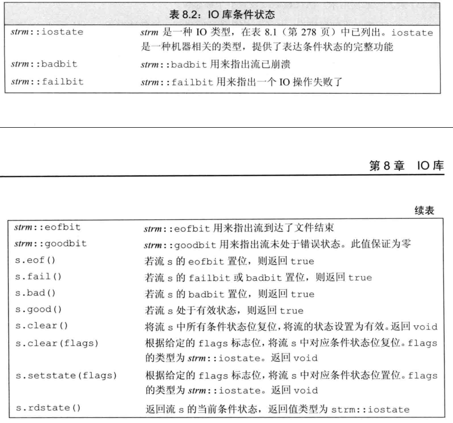

# IO库
## IO 类
头文件
- `iostream` 读写流
- `fstream` 文件流
- `sstream` 字符流

为了支持`wchar`的使用，标准库定义了一组类型来操纵`wchar`.
在类型或函数前加`w`即可，例如`wcin`,`wcout`.

`io`对象无拷贝或赋值，即无法对流对象进行赋值和拷贝。

`io`操作是很可能发生错误的，因此需要一种手段来访问和操纵流的状态。
 

`io`库定义了一个机器无关的`iostate`类型，用来表示流的状态。
- `badbit`表示系统及错误，流无法再使用
- `failbit`通常表示可恢复错误
- `eofbit`表示文件结束

### 输出buffer

每个输出流都有一个输出缓冲区，比如输出到`cout`的数据不一定会被立刻打印，为了效率有可能会暂存在缓冲区内。

刷新缓冲区的原因
1. 程序运行结束，缓冲刷新
2. 缓冲区满
3. `endl` `ends` `flush`显式刷新
4. 可以使用`unitbuf`来清空缓冲区
5. 读写被关联的流会刷新


`unitbuf`可以使得输出流以后都立刻刷新
```cpp
cout << unitbuf; // 此后的输出流都立刻刷新
cout << nounitbuf; // 回到正常的缓冲

```

**程序崩溃则不会刷新缓冲区，所以用于`debug`的输出信息最好立刻刷新。**

#### 关联输入输出流
当一个输入流被关联到一个输出流的时候
任何对输入流的读取，都会导致输出流先刷新。
`cout`和`cin`就是被关联到了一起，用户的输入会先被输出。

```cpp
cin.tie(&cout);
ostream *old = cin.tie(nullptr); //返回之前tie的输出流
```

## 文件输入输出

文件流的操作就是
1. `fstrm.open(name)`打开文件
2. 对流进行操作，输入输出等
3. `fstrm.close()`关闭文件

自动构造和析构：没啥说的，类似于普通的变量离开其作用域就被销毁了。


### 文件模式
就是文件的一些权限，使用的时候再查也不耽误。

需要注意的是`out`模式打开文件会丢失内容，必须添加`app`模式才可以保留之前的内容。


## string流
没啥可说的。
