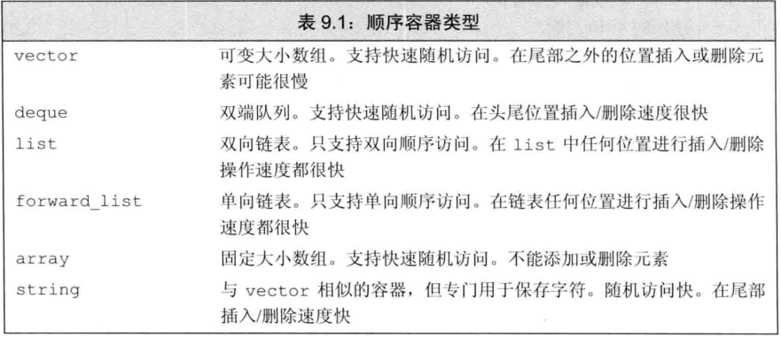
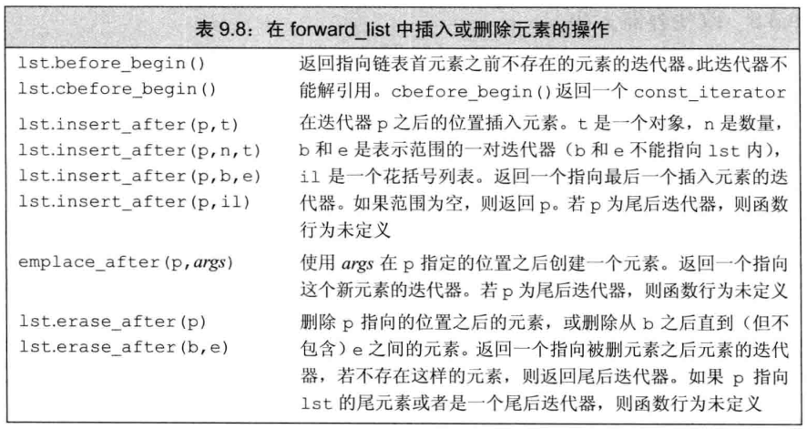
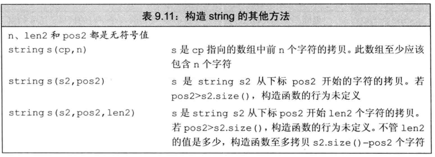
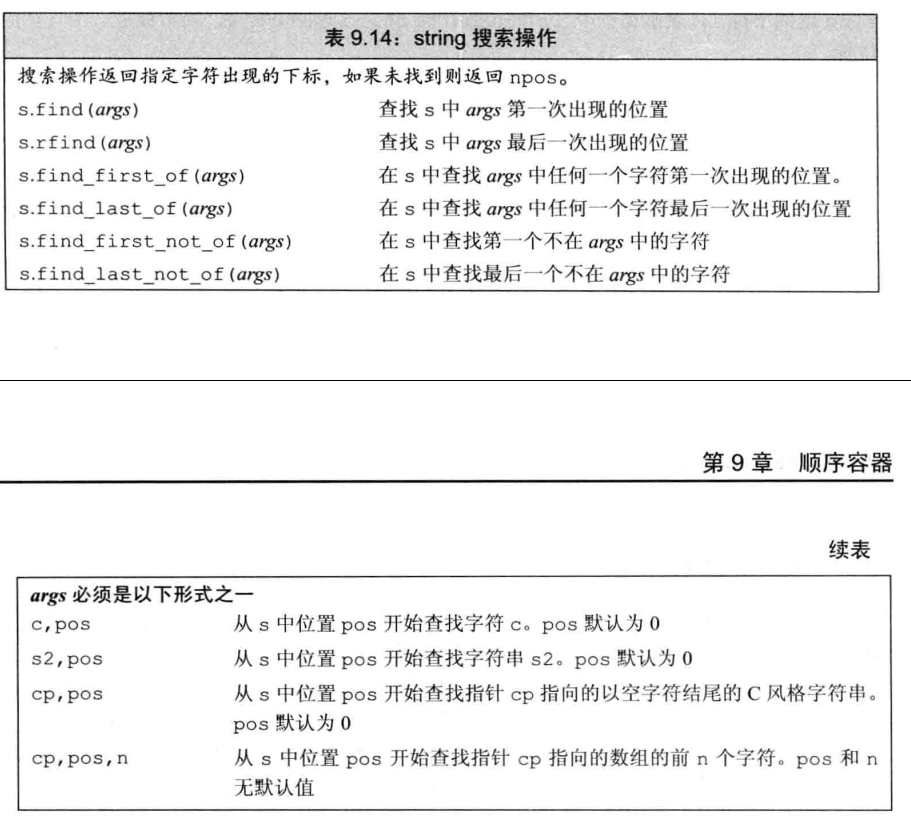
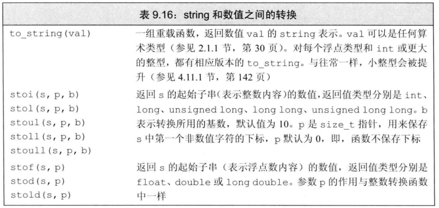

# 顺序容器

顺序容器有如下这些类型

## 容器库
所有容器库有一部分共有的操作，也有部分仅仅只有顺序容器，关联容器或无序容器有。

顺序容器默认的构造函数是接受一个容器大小，当容器内的类没有默认构造函数的时候，就需要容器提供一个元素初始化器,初始化器创建一个对象并返回即可。

### 迭代器

**`list`的迭代器比较起来比较困难，因为`list`的指针大小并不代表先后顺序，所以要避免使用`list`的迭代器比较大小**

可以通过`container<T>::reference`获取`T`类型的引用，也可以把`reference`换成`value_type`获取容器内元素的类型。

### 容器的定义和初始化
初始化时，可以使用一个容器的迭代器来初始化其他容器。
`vector<int> vec(vec1.begin(),vec1.end())`

特别的，标准库的`array`的大小属于类型的一部分。`array<int,42>`

### 赋值和swap
容器的赋值将会拷贝容器内的元素。

`swap`可以交换容器内的元素
`assign`可以利用迭代器来给容器内赋值，会清除之前的值。

`swap`对容器的交换仅仅交换一些数据结构，除了`array`，`array`的`swap`会交换每一个数据，因此所需的时间是线性的。

### 顺序容器操作
`push_back`在容器末尾追加一个元素，除了`array`和`forward_list`都有，类似的还有`push_front`，这个只有`list`，`forward_list`和`deque`有。

`insert`插入函数，第一个参数是一个迭代器，将元素插入迭代器之前的位置，返回新插入元素的迭代器

**`insert`等改变了容器大小的操作会使得迭代器失效**

#### emplace操作
`emplace`与`push`的区别就是，`push`是将元素拷贝添加到容器中，而`emplace`则是构造一个元素添加到容器中。

### 访问元素
大部分容器都有`back`和`front`的操作，可以获得头和尾元素的引用。
使用`at`获取对应下标元素，带越界检查。

用来访问成员的函数返回的都是引用，`const`容器返回的是`const`引用。

### 删除元素
`pop_back/front`删除头尾元素
`erase`接受迭代器，可以删除迭代器指定的元素，也可以删除两迭代器间的元素，返回被删元素之后的位置

### 特殊的forward_list
针对`forward_list`的操作
 

大部分操作都是在迭代器之后的位置进行插入，并返回插入后的第一个元素的迭代器。

### 改变容器大小

除了`array`，都可以用resize改变容器大小.
`ilist.resize(n,value)`可以扩大或减小，多出来的部分可以给定一个初值

### 容器操作可能造成的迭代器失效
不要保存`end`返回的迭代器因为他可能会由于某种操作而失效。

## vector 是如何增长的
在`vector`或`string`的实现中，通常分配的内存比需求要更大，避免反复申请。

他们也提供里一些用于容量管理的函数
- `shrink_to_fit`:只用于`vector`,`string`和`deque`，让容量变为和`size`一样大,仅仅是请求，并不保证
- `capacity`: 只用于`vector`和`string`,返回容量
- `reserve(n)`: 分配至少能容纳`n`个元素的空间

## string的一些操作
存在一些为了兼容`c`字符串的构造函数
 

`substr`返回一个`string`，可以利用其来返回部分字符串

### string 搜索操作
`string`有6个搜索函数，每个函数有4个重载的版本，每个都返回一个`string::size_type`作为下标，如果没找到，则返回一个`string::npos`.

 
可以指定起始的查找位置，以及查找字符串的前多少个字符。

### compare

重载了很多，有指定一个位置的，指定两个位置的，还有和`c`字符串比较的。

### 数值转换
如下图
 

## 容器适配器
容器适配器是一种机制，可以让一个容器带有某种特质。
比如`stack`适配器接受一个顺序容器，就带有了栈的一些操作。
`stack<int> stk`,默认情况下`stack`和`queue`是`deque`来实现的，但我们也可以指定顺序容器:`stack<int,vector<int>> stk1;`

适配器都有自己的特点，根据这些特点也只能由部分容器类实现

### stack
栈的操作有四个:`pop` `push` `top` `emplace`.
因此除了`forward_list`和`ararry`其他都可以实现`stack`

### 队列
`queue`和`priority_queue`
`queue`先进先出，所以不能用`vector`
`priority_queue`需要随机访问的能力，所以不能用于`list`

