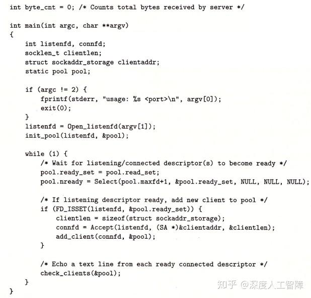
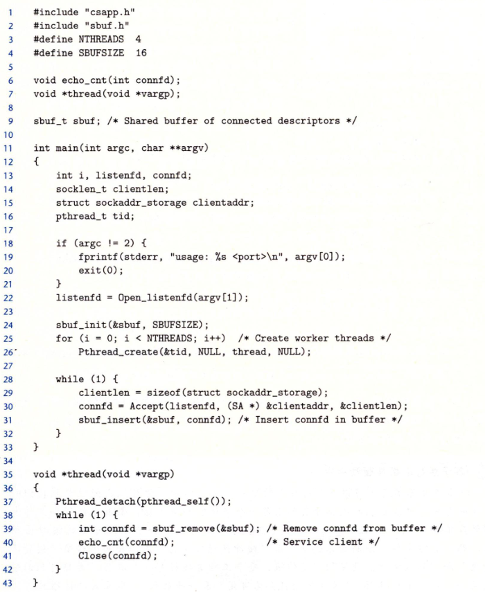

# 并发编程

程序的并发是很有必要的，比如一个程序阻塞后应当下处理机以提高cpu利用率。

## 12.1 基于进程的并发编程

就上一章的web服务器来讲，当服务器接受客户1的请求后，fork出子进程来进行数据传输，服务器继续接受其他的客户请求。

值得注意的有以下几点：
1. 服务器需要利用sigchld处理函数回收子进程资源，且由于处理函数执行时sigchld信号时被阻塞的，而linux信号也不排队，所以一次处理函数需要回收尽可能多的子进程资源
2. 父进程需要关闭connfd,而子进程需要关闭listenfd


缺点:进程间的通信开销很大，IPC机制包括`waitpid`函数和`signal`系列函数,也包括管道，共享内存以及信号量。

### 习题12.1 为什么父进程关闭了connfd,子进程仍然能够使用该描述符
因为fork出的子进程是复制父进程而来的，文件表中connfd指向的表项引用值为2,父进程关闭后引用值为1,文件并未关闭,所以子进程仍然可以读写connfd。

### 习题12.2 如果删除子进程中的关闭connfd的代码，程序仍然能执行正确，为什么？
因为exit退出后,会关闭所有的fd，connfd描述符指向的文件仍然会被关闭。

## 基于io多路复用的并发编程

当我们要求web服务器能响应用户的标准输入和客户端的http请求，两个独立的io事件，则无法进行阻塞，因为阻塞一个另一个就不可以响应了，解决办法就是io多路复用

```c
#include <sys/select.h>
int select(int nfds, fd_set *readfds,
          fd_set *writefds,
          fd_set *exceptfds,
          struct timeval *timeout);
void FD_CLR(int fd, fd_set *set);
int  FD_ISSET(int fd, fd_set *set);
void FD_SET(int fd, fd_set *set);
void FD_ZERO(fd_set *set);
```

本节使用`select(fd,fdset,NULL,NULL,NULL)`;

`select`函数执行的逻辑如下：
使用`FD_ZERO`函数初始化fdset,然后使用`FD_SET`向fdset中添加fd,之后调用`select`函数阻塞，直到fdset有可以读取一个字符的fd后，`select`会修改fdset,使其包含可以修改的fd,利用`FD_ISSET`，循环去判断每一个添加过的fd是否在fdset中。

### 习题12.3 如果select阻塞时输入ctrl+d（EOF）,会发生什么？
当输入eof后，select返回，然后read读取到eof不会读取，返回0,

## 12.2 io多路复用与状态机

引入一个连接池，将所有connfd放入连接池进行管理。

**注意状态机的体现,当`add_client`后，该连接进入readset,而不是readyset，在下次循环开始`readyset=readset`后才可以被`check_client`响应。所以每一个连接都会有：阻塞，可以读，读取**


每次select返回后调用accept，accept立即返回connfd,然后将该connfd加入连接池，最后由统一的处理函数对连接池内的fd进行响应，并关闭对应的fd。


优点：很容易进行事件驱动的编程
缺点: 编码困难，随着粒度变小，代码复杂性还会上升

## 12.3 基于线程的并发编程

线程的上下文比进程小了许多，切换的开销少了许多，而且线程都运行在一个进程内的虚拟地址空间，共享代码，数据，堆等资源。


### posix线程
posix线程(pthreads)是线程的一个标准接口，所有linux都遵循了该接口。
Pthreads定义了许多函数，包括程序创建回收线程，共享数据等。

一个简单的ptreads程序：
```c
void *thread(void *vargp)
int main(){
  pthread_t tid;
  Pthread_create(&tid,NULL,thread,NULL);
  Pthread_join(tid,NULL);
  exit(0);
}
void *thread(void *vargp){
  printf("Hello world\n");
  return NULL;
}
```
### 创建线程
`pthread_create`函数创建一个线程，带着一个输入变量`arg`作为线程函数的参数,新线程运行`start_routine`,用attr参数改变新创建线程的默认属性。

```c
#include <pthread.h>
int pthread_create(pthread_t *restrict thread,
                  const pthread_attr_t *restrict attr,
                  void *(*start_routine)(void *),
                  void *restrict arg);
```
### 终止线程

1. 当线程的例程返回时，线程会隐式的终止
2. 通过调用`pthread_exit`，线程会显式的终止。如果主线程调用该函数，则会等到全部子线程终止后，再终止主线程以及整个进程，返回值为`retval`;
3. 当对等线程调用`exit`函数时，会终止整个进程。
4. 对某个指定线程的终止可以调用`pthread_cancel`,目标线程可以调用`pthread_testcancel`来设置撤销点，线程会在撤销点处终止。

```c
#include <pthread.h>
[[noreturn]] void pthread_exit(void *retval);
void pthread_testcancel(void);
int pthread_cancel(pthread_t thread);
```


### 回收已经终止的线程

`pthread_join`会阻塞等待`tid`线程终止，并回收其资源，修改`retval`指针指向终止线程指向的那个返回值处

```c
#include <pthread.h>
int pthread_join(pthread_t thread, void **retval);
```

### 分离线程

线程是可以结合和分离的，分离的线程不可以被其他线程杀死,终止后由系统自动释放其资源。而线程默认是可结合的。
线程可以通过`pthread_self`函数获得tid,从而分离自身。

```c
#include <pthread.h>
int pthread_detach(pthread_t thread);
```
### 初始化线程

`pthread_once`可以使多线程状态下某个函数只执行一次,当`once_control`为init状态，则执行`init_routine`,否则不执行。

```c
#include <pthread.h>

int pthread_once(pthread_once_t *once_control,
    void (*init_routine)(void));
pthread_once_t once_control = PTHREAD_ONCE_INIT;
```

###  基于线程的web服务器
```c

int main(){
  int *connfdp;
  listenfd = open_listenfd(port);

  while(1){
    connfd = malloc(sizeof(int));
    *connfd = accept(listenfd,&clientaddr,&clientlen); 
    //此处可能会发生race现象
    //需要进行流程控制;
    pthread_create(&tid,NULL,serv,connfdp);
  }
}
void *thread(void *vargp){
  int connfd = *(int*)vargp;//复制连接描述符
  pthread_detach(pthread_self);
  free(vargp);//释放原来连接描述符的空间
  close(connfd);
  return NULL;
}
```

### 习题12.5 为什么线程的模型只需要在一个地方关闭描述符？
因为线程内的资源是共享的，一个进程内共享一个描述符表，文件的打开计数值一直是1；

## 多线程的共享变量
### 线程内存模型

进程内被各个线程共享的有：虚拟内存空间，代码段，堆区，共享库，数据区域和读写数据。
各个线程独立的有：线程id,栈，栈指针，pc,psw等

线程的栈是不对其他线程设防的，所以可以通过指针传递线程栈上的数据。

### 变量与内存

全局变量：全局变量所有线程都可以用变量名访问
本地局部变量：存在于线程栈上，每个线程都有一个变量实例，其他线程也可以访问，但是需要注意变量的生命周期
本地静态变量：本地局部变量是指定义在函数内部的`static`变量，虚拟内存的读写只包含这一个静态变量，比如多个线程执行一个函数，那么函数内部的`static`变量会被多个线程访问。

## 信号量

(万恶的)Dijkstra提出了信号量的方案;
```c
#include <semaphore.h>
int sem_init(sem_t *sem, int pshared, unsigned int value);
```

`pshared`是指是否可以被进程共享，0为不可以，非0为可以.


### 生产者消费者模型

```c
void item_insert(sbuf_t *sp,int item){
  p(empty);
  p(mutex);
  insert(item);
  v(mutex);
  v(full);
}
int item_remove(sbuf_t *sp){
  p(full);
  p(mutex);
  remove(item);
  v(mutex);
  v(empty);
}
```

### 读者写者问题

不限制读者的读，但是写者在写时会有独占的权力

#### 第一类 读者优先

读者不会因为有写者读而等待写者。
```c
void reader(){
  while(1){
    p(&mutex);
    readcnt++;
    if(readcnt==1) p(w);//第一个读者上读者锁
    v(&mutex);
    //读取
    p(&mutex);
    readcnt--;
    if(readcnt==0) v(w);//最后一个读者解锁
    v(&mutex);
  }
}
void writer(){
  while(1){
    p(w);
    //写
    v(w);
  }
}
```
##  预线程化的web服务器

预线程化实际上就是提前建立一个线程池，之后为客户端分配线程再执行。

```c
typedef struct{
  int *buf;
  int n;
  int front;
  int rear;
  sem_t mutex;
  sem_t slots;
  sem_t items;
}sbuf_t;
```

25,26行创建了许多线程，线程会在39行因为P操作阻塞住，等待30,31行`accept`返回`connfd`后插入`sbuf`内。之后线程获得`connfd`响应客户请求以及关闭`connfd`描述符
 


**多线程的缺点也不是没有，pv操作的开销很大，要尽可能避免，如果不能避免，就尽可能多的并行去弥补pv同步的开销。
可以把多个线程访问的内存单元独立出来，这样就不需要互斥访问了，等所有线程都终止后再根据各个线程的结果进行处理**

## 线程安全
线程不安全的四种函数类
1. 不保护共享变量的安全函数
2. 当前调用结果依赖上一次的中间结果的函数（其实还是没有保护共享变量）。
3. 返回指向静态变量指针的函数。
4. 调用其他不安全函数的含糊

### 可重入性
线程安全函数中有一类很特别，叫做可重入的函数，他们不包含任何的共享数据，所以可以被多个线程随意调用。

linux提供了大多数线程不安全函数的可重入版本，可重入版本的名字总是以`_r`结尾。

