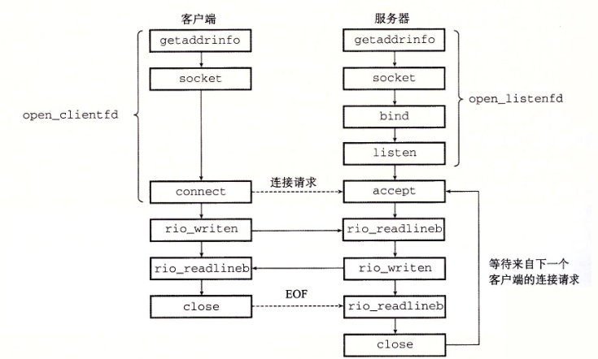

# network programming
 
## 11.1 cs mode
事务是cs模型中的基本操作，客户发送请求，服务器解释请求并返回响应，客户接受响应并处理

## 网络


两个节点按照一定的协议进行通信，数据是通过不连续的包进行传送的。

## tcp/ip 协议

### 11.3.1 ip address

```c
struct in_addr{
  uint32_t s_addr;
}
```
s_addr 按照大端方式存放ip地址.(大端：低字节存放高位小端反之)

ip地址通常的表示方式为点分十进制，可以通过一些函数实现ip地址与点分十进制的字符串转换.

```c
#include <arpa/inet.h>

uint32_t htonl(uint32_t hostlong);
uint16_t htons(uint16_t hostshort);

uint32_t ntohl(uint32_t netlong);
uint16_t ntohs(uint16_t netshort);
```
h 是host的意思，n是net的意思，s=short,l=long
这一系列函数可以从主机的字节序转换至网络字节序


### 11.3.2 domain name
ip不符合人类的习惯，域名是用来帮助人类记忆的

nslookup程序可以用于查看域名对应的ip地址
localhost对应127.0.0.1

hostname 程序可以用于查看本机对应的域名

多个域名可以映射到同一个ip地址，同时多个域名也可以映射到一组ip上

### 11.3.3 网络连接
套接字 socket 是由ip地址和端口号组成的,用于网络传输,一个连接的两端的套接字地址是唯一的.
知名端口的映射存放在`/etc/services`中

## 11.4 socket接口
大多数操作系统都实现了套接字接口，以用于网络通信
计算机通过四元组来对端口进行复用，比如多个客户机访问同一个主机的80端口，则服务器的80端口接收到的信息会根据四元组来进行分配信息（src ip:port,dst ip:port）
 

### 11.4.1 socket address
```c
struct sockaddr_in {  //_in代表的是internet
    uint16_t sin_family; // 地址族，通常为AF_INET
    uint16_t sin_port; // 端口号
    struct in_addr sin_addr; // IP地址
    char sin_zero[8]; // 用于填充，保证结构体大小与sockaddr一致
};
struct sockaddr{
  uint16_t sa_family;//协议
  char sa_data[14];//地址数据
};
```

为了能让函数接受各种类型的socket结构体，使用socketaddr结构体指针来提供泛用性，在函数内部再进行解析。

### socket 函数


```c
#include <sys/socket.h>

int socket(int domain, int type, int protocol);
```
使用socket函数用来创建一个套接字描述符。
`clientfd = socket(AF_INET,SOCK_STREAM,0)`
AF_INET表示internet,ip地址32位，SOCK_STREAM是指这个套接字是连接的一个端点


### connect 函数

```c
#include <sys/socket.h>
int connect(int sockfd, const struct sockaddr *addr,
            socklen_t addrlen);
```
connect 按照sockfd建立与目标ip服务器的连接,其中addrlen为`strlen(sockaddr_in)`,connect 在调用时会被阻塞，知道连接成功或失败，成功时就可以按照clientfd进行读写
对于socket最好使用`getaddrinfo`为connect提供参数

### bind
```c
#include <sys/socket.h>
int bind(int sockfd, const struct sockaddr *addr,
        socklen_t addrlen);
```
bind函数是服务器用来与客户机建立连接时使用的
bind将addr中的服务器套接字地址与sockfd联系到一起，参数最好由`getaddrinfo`提供.

### listen
默认情况下内核会认为`socket`创建的fd是用于主动连接的fd,调用`listen`使得内核得知该fd是用于被连接的。

```c
#include <sys/socket.h>

int listen(int sockfd, int backlog);
```
`listen`的调用将一个主动套接字转换为监听套接字，`backlog`指的是拒绝连接时的队列长度，通常设置为一个较大的值


### accept

```c
#include <sys/socket.h>

int accept(int listenfd, struct sockaddr *addr,
        socklen_t *addrlen);
```
`accept`函数等待客户端的连接请求，在`addr`中填写`listenfd`监听到的客户端套接字的地址，函数创建一个`socket`，设置其参数并返回这个已经连接的`sockfd`,


**大致流程为：服务器端使用`socket`函数创建`sockfd`，然后调用`listen`使得该`sockfd`转换为监听套接字，调用`accept`，阻塞等待指定客户端的连接，客户调用`connect`与服务器进行连接，服务器`accept`函数返回`connfd`，此时客户端与服务端已经就已经建立了连接**


### 主机与服务的转换
#### getaddrinfo
```c
int getaddrinfo(const char *restrict host,
                const char *restrict service,
                const struct addrinfo *restrict hints,
                struct addrinfo **restrict res);
```
参数`service`是指服务名或端口号，`host`则为主机ip或域名。

`getaddrinfo`将主机名，主机地址，服务名和端口号的字符串转换为套接字地址结构(一条链表，包含所有与`host`和`service`有关的addrinfo的结构体变量,**其中addrinfo中的`ai_addr`指向的包含对应ip与端口的sockaddr结构体**)，适用于任何协议。

给定`host`与`service`，函数返回`result`指向一个`addrinfo`结构的链表(对应一个或多个`addrinfo`结构体)

客户端在调用`getaddrinfo`后，遍历里这个列表，尝试每一个套接字地址，直到调用`socket`与`connect`成功,同样的，服务端则调用`socket`和`bind`.

`service`和`host`可以有一个是`NULL`,若`host`为空，则`res`指向的为本机的套接字地址信息，反之则为`host`对应的主机的套接字地址信息。

值得注意的是程序最后必须调用`freeaddrinfo`释放链表，避免内存泄漏。


`hints`为可选参数，是一个`addrinfo`的结构体指针，提供对`res`更好的控制，只能设置以下字段，其他字段必须为0，。
`ai_family`:可以限制返回的ip地址是ipv4或ipv6
`ai_socktype`:对于host关联的所有地址，`getaddrinfo`最多只返回3个，他们的`ai_socktype`不同，分别是连接(TCP)，数据报(UDP)和与原始套接字，将该字段设置为`SOCK_STREAM`则表示对每一个ip地址，列表中只存放一个元素，且该元素内指向的套接字可以作为连接的端点使用。
`ai_protocol`
`ai_flags`:该字段是一个位掩码，可以将取值相与。

```c
struct addrinfo {
    int ai_flags;           // 用于控制地址解析的标志
    int ai_family;          // 地址族，如AF_INET、AF_INET6等
    int ai_socktype;        // 套接字类型，如SOCK_STREAM、SOCK_DGRAM等
    int ai_protocol;        // 协议类型，如IPPROTO_TCP、IPPROTO_UDP等
    socklen_t ai_addrlen;   // ai_addr的长度
    struct sockaddr* ai_addr;   // 指向地址结构的指针
    char* ai_canonname;     // 规范主机名
    struct addrinfo* ai_next;   // 指向下一个addrinfo结构体的指针
};
```

`socket`函数族可以通过`getaddrinfo`得到的`addrinfo`来填写参数。

#### getnameinfo

与getaddrinfo相反，getnameinfo可以将`socket`地址转换为主机与服务名字符串

```c
#include <sys/socket.h>
#include <netdb.h>
int getnameinfo(const struct sockaddr *restrict addr, socklen_t addrlen
                char host[_Nullable restrict .hostlen],
                socklen_t hostlen,
                char serv[_Nullable restrict .servlen],
                socklen_t servlen,
                int flags);
```
`host`和`service`指向存放`host`和`service`字符串的缓冲区，另外两个参数是缓冲区的大小

`flags`也是一个位掩码，其中常用的值有
`NI_NUMERICHOST`:存入`host`ip地址而非域名
`NI_NUMERICSERV`:该函数默认会查找`/etc/services`,返回服务名，设置该参数则直接返回端口号

**总的来说，`getaddrinfo`通过主机域名或ip地址可以直接得到对应的`socketaddr`,而`getnameinfo`则相反**


#### 练习题11.4 通过getaddrinfo getnameinfo与inet_pton inet_ntop获得ip地址

```c
#include <arpa/inet.h>
#include <fcntl.h>
#include <netdb.h>
#include <netinet/in.h>
#include <stdio.h>
#include <stdlib.h>
#include <string.h>
#include <unistd.h>
int main(int argc, char **argv) {
  struct addrinfo *p, *listp, hints;
  char buf[1024];
  int rc, flags, temp;
  if (argc != 2) {
    printf("plz enter an domain name\n");
    exit(0);
  }
  memset(&hints, 0, sizeof(struct addrinfo));
  hints.ai_socktype = SOCK_STREAM;
  hints.ai_family = AF_INET;
  if ((rc = getaddrinfo(argv[1], NULL, &hints, &listp)) != 0) {
    printf("getaddrinfo error");
    exit(0);
  }
  flags = NI_NUMERICHOST;
  for (p = listp; p; p = p->ai_next) {
    struct sockaddr_in *sockp = (struct sockaddr_in *)p->ai_addr;
    inet_ntop(AF_INET, &sockp->sin_addr.s_addr, buf, 1024);
    printf("inet_pton : %s\n", buf);
    getnameinfo(p->ai_addr, p->ai_addrlen, buf, 1024, NULL, 0, flags);
    printf("getnameinfo : %s\n", buf);
  }
  freeaddrinfo(listp);
  exit(0);
}
```

### sock的辅助函数

由于上面几节中讲的函数有些过于吓人，可以采取包装的方式进行更方便的使用
```c
int open_clientfd(char *hostname,char *port){
  int clientfd;
  struct addrinfo hints,*listp,*p;

  memset(&hints,0,sizeof(struct addrinfo));
  hints.ai_socktype = SOCK_STREAM;
  hints.ai_flags = AI_NUMERICSERV|AI_ADDRCONFIG;
  getaddrinfo(hostname,port,&hints,&lisp);

  for(p = listp;p;p=p->ai_next){
    if((clientfd = socket(p->ai_family,p->ai_socktype,p->ai_protocol))<0)
      continue;
    if(connect(clientfd,p->ai_addr,p->ai_addrlen)!=-1)
      break;
    close(clientfd);
  }
  freeaddrinfo(listp);
  if(!p)
    return -1;
  else 
    return clientfd;
}
```
`open_clientfd`内部调用`socket`和`connect`与服务器进行连接；

与之对应的服务器端可以调用包装函数`open_listenfd`进行与客户机的连接

在创建监听socket时，先调用`socket`函数创建一个套接字，然后调用`bind`函数使得该套接字与该端口绑定，ip为`0.0.0.0`,表示该监听socket将监听本机指定端口的所有ip的信息。

```c 
int open_listenfd(char *port){
    struct addrinfo hints, *listp, *p;
    int listenfd, optval=1;

    /* Get a list of potential server addresses */
    memset(&hints, 0, sizeof(struct addrinfo));
    hints.ai_socktype = SOCK_STREAM;             /* Accept connections */
    hints.ai_flags = AI_PASSIVE | AI_ADDRCONFIG; /* ... on any IP address */
    //AI_PASSIVE保证套接字地址可被服务器用作监听套接字
    hints.ai_flags |= AI_NUMERICSERV;            /* ... using port number */
    getaddrinfo(NULL, port, &hints, &listp);  //这里的host为NULL

    /* Walk the list for one that we can bind to */
    for (p = listp; p; p = p->ai_next) {
        /* Create a socket descriptor */
        if ((listenfd = socket(p->ai_family, p->ai_socktype, p->ai_protocol)) < 0) 
            continue;  /* Socket failed, try the next */

        /* Eliminates "Address already in use" error from bind */
        setsockopt(listenfd, SOL_SOCKET, SO_REUSEADDR,    //line:netp:csapp:setsockopt
                   (const void *)&optval , sizeof(int));

        /* Bind the descriptor to the address */
        if (bind(listenfd, p->ai_addr, p->ai_addrlen) == 0)
            break; /* Success */
        close(listenfd); /* Bind failed, try the next */
    }

    /* Clean up */
    freeaddrinfo(listp);
    if (!p) /* No address worked */
        return -1;

    /* Make it a listening socket ready to accept connection requests */
    if (listen(listenfd, LISTENQ) < 0) {
        Close(listenfd);
	return -1;
    }
    return listenfd;
}
```

### web服务器

静态内容：服务器传送给客户端磁盘文件
动态内容：传送可执行文件的执行输出

#### http 请求
`method URI version`
URI是对应url的后缀，包括文件名和可选参数

##### 请求报头
`header-name:header-data`
下面的请求报头是http1.1需要的，代理判断是否在缓存当中存在被请求的内容。
`Host:www.aol.com`


#### http响应

响应的组成：一个响应行，伴随着一些响应报头 header，在跟一个空行，然后跟随响应主体。

##### 响应行
响应行的格式如下
`version status-code status-message`

##### 响应报头

`header:data`
其中比较重要的是`content-Type`和`Content-Length`,一个表示响应体中的内容类型，另外一个指示响应体的字节大小。


### 动态内容

服务器通过cgi,通用网关接口向客户端提供动态内容服务

客户端通过请求将参数传递给服务端，get请求的参数在uri中，`?`分割了文件名和参数，每个参数用`&`隔开，参数中的空格使用`%20`来表示，对其他的特殊字符也采用类似的编码。

post的参数在请求体里面。

服务器需要fork出子进程执行可执行文件，然后通过`getenv`来获取uri中的参数，子进程也要负责生成`content-Type`和`Content-Length`,以及终止header的空行.

可执行文件的输出通过`dup2`函数重定向至与客户端相连的`sockfd`.

- 对于post请求，子进程也需要将标准输入重定向到已连接描述符上，然后cgi程序从标准输入读入请求体获取参数

###  tiny web server

大致的逻辑是服务器监听一个固定端口，然后接收客户端的请求，并读取请求行以及请求体，然后分析请求行和请求体，发送对应的信息,下面是源代码。

**服务器的accept函数在执行时会复制listenfd的socket,之后设置该socket使其与客户机相关联，然后读写这个socketfd即可**

```c
/* $begin tinymain */
/*
 * tiny.c - A simple, iterative HTTP/1.0 Web server that uses the
 *     GET method to serve static and dynamic content.
 *
 * Updated 11/2019 droh
 *   - Fixed sprintf() aliasing issue in serve_static(), and clienterror().
 */
#include "csapp.h"
#include <bits/types/sigset_t.h>
#include <signal.h>
#include <stdio.h>
#include <stdlib.h>
#include <string.h>
#include <strings.h>
#include <sys/types.h>

void sigpipe_handler(int s);
void read_requestbody(rio_t *rp, char *body);
void doit(int fd);
int read_requesthdrs(rio_t *rp, char *method);
int parse_uri(char *uri, char *filename, char *args);
int parse_post_uri(char *uri, char *filename, char *args);
void serve_static(int fd, char *filename, int filesize, char *method);
void get_filetype(char *filename, char *filetype);
void serve_dynamic(int fd, char *filename, char *args, char *method,
                   int is_post);
void clienterror(int fd, char *cause, char *errnum, char *shortmsg,
                 char *longmsg);
void sigchld_handler(int s) {
  pid_t pid = Wait(NULL);
  printf("\npid : %d is terminated\n", pid);
}
int main(int argc, char **argv) {
  int listenfd, connfd;
  char hostname[MAXLINE], port[MAXLINE];
  socklen_t clientlen;
  struct sockaddr_storage clientaddr;

  signal(SIGCHLD, sigchld_handler);
  /* Check command line args */
  if (argc != 2) {
    fprintf(stderr, "usage: %s <port>\n", argv[0]);
    exit(1);
  }

  listenfd = Open_listenfd(argv[1]);
  while (1) {
    clientlen = sizeof(clientaddr);
    connfd = Accept(listenfd, (SA *)&clientaddr,
                    &clientlen); // line:netp:tiny:accept
    Getnameinfo((SA *)&clientaddr, clientlen, hostname, MAXLINE, port, MAXLINE,
                0);
    printf("Accepted connection from (%s, %s)\n", hostname, port);
    doit(connfd);  // line:netp:tiny:doit
    Close(connfd); // line:netp:tiny:close
  }
}
/* $end tinymain */

/*
 * doit - handle one HTTP request/response transaction
 */
/* $begin doit */
void doit(int fd) {
  int is_static, is_post = 0, length; // length only be used when method is
                                      // post;
  struct stat sbuf;
  char buf[MAXLINE], method[MAXLINE], uri[MAXLINE], version[MAXLINE],
      body[MAXLINE] = "";
  char filename[MAXLINE], args[MAXLINE];
  rio_t rio;

  /* Read request line and headers */
  Rio_readinitb(&rio, fd);
  if (!Rio_readlineb(&rio, buf, MAXLINE)) // line:netp:doit:readrequest
    return;
  printf("%s", buf);
  sscanf(buf, "%s %s %s", method, uri, version); // line:netp:doit:parserequest
  if (strcasecmp(method, "GET") && strcasecmp(method, "POST") &&
      strcasecmp(method, "HEAD")) { // line:netp:doit:beginrequesterr
    clienterror(fd, method, "501", "Not Implemented",
                "Tiny does not implement this method");
    return;
  }                                        // line:netp:doit:endrequesterr
  length = read_requesthdrs(&rio, method); // line:netp:doit:readrequesthdrs

  /* Parse URI from GET request */
  is_static = parse_uri(uri, filename, args); // line:netp:doit:staticcheck
  if (!is_static && !strcasecmp(method, "POST")) {
    is_post = 1;
    Rio_readnb(&rio, args, length);
    args[length] = '\0';
    printf("%s : length is %d\n", args, length);
  }
  if (stat(filename, &sbuf) < 0) { // line:netp:doit:beginnotfound
    clienterror(fd, filename, "404", "Not found",
                "Tiny couldn't find this file");
    return;
  } // line:netp:doit:endnotfound

  if (is_static) { /* Serve static content */
    if (!(S_ISREG(sbuf.st_mode)) ||
        !(S_IRUSR & sbuf.st_mode)) { // line:netp:doit:readable
      clienterror(fd, filename, "403", "Forbidden",
                  "Tiny couldn't read the file");
      return;
    }
    serve_static(fd, filename, sbuf.st_size,
                 method); // line:netp:doit:servestatic
  } else {                /* Serve dynamic content */
    if (!(S_ISREG(sbuf.st_mode)) ||
        !(S_IXUSR & sbuf.st_mode)) { // line:netp:doit:executable
      clienterror(fd, filename, "403", "Forbidden",
                  "Tiny couldn't run the CGI program");
      return;
    }
    serve_dynamic(fd, filename, args, method,
                  is_post); // line:netp:doit:servedynamic
  }
}
/* $end doit */

/*
 * read_requesthdrs - read HTTP request headers
 */
/* $begin read_requesthdrs */
int read_requesthdrs(rio_t *rp, char *method) {
  char buf[MAXLINE];
  int len = 0;
  do {
    Rio_readlineb(rp, buf, MAXLINE);
    printf("%s", buf);
    if (strcasecmp(method, "POST") == 0 &&
        strncasecmp(buf, "Content-Length:", 15) == 0) {
      sscanf(buf, "Content-Length: %d", &len);
    }
  } while (strcmp(buf, "\r\n"));
  return len;
}
/* $end read_requesthdrs */

/*
 * parse_uri - parse URI into filename and CGI args
 *             return 0 if dynamic content, 1 if static
 */
/* $begin parse_uri */
int parse_uri(char *uri, char *filename, char *args) {
  char *ptr;
  if (!strstr(uri, "cgi-bin")) {
    /* Static content */             // line:netp:parseuri:isstatic
    strcpy(args, "");                // line:netp:parseuri:clearcgi
    strcpy(filename, ".");           // line:netp:parseuri:beginconvert1
    strcat(filename, uri);           // line:netp:parseuri:endconvert1
    if (uri[strlen(uri) - 1] == '/') // line:netp:parseuri:slashcheck
      strcat(filename, "home.html"); // line:netp:parseuri:appenddefault
    return 1;
  } else { /* Dynamic content */ // line:netp:parseuri:isdynamic
    ptr = index(uri, '?');       // line:netp:parseuri:beginextract
    if (ptr) {
      strcpy(args, ptr + 1);
      *ptr = '\0';
    } else
      strcpy(args, "");    // line:netp:parseuri:endextract
    strcpy(filename, "."); // line:netp:parseuri:beginconvert2
    strcat(filename, uri); // line:netp:parseuri:endconvert2
    return 0;
  }
}
/* $end parse_uri */

/*
 * serve_static - copy a file back to the client
 */
/* $begin serve_static */
void serve_static(int fd, char *filename, int filesize, char *method) {
  int srcfd;
  char *srcp, filetype[MAXLINE], buf[MAXBUF];

  /* Send response headers to client */
  get_filetype(filename, filetype);    // line:netp:servestatic:getfiletype
  sprintf(buf, "HTTP/1.0 200 OK\r\n"); // line:netp:servestatic:beginserve
  Rio_writen(fd, buf, strlen(buf));
  sprintf(buf, "Server: Tiny Web Server\r\n");
  Rio_writen(fd, buf, strlen(buf));
  sprintf(buf, "Content-length: %d\r\n", filesize);
  Rio_writen(fd, buf, strlen(buf));
  sprintf(buf, "Content-type: %s;  charset=utf-8\r\n\r\n", filetype);
  Rio_writen(fd, buf, strlen(buf)); // line:netp:servestatic:endserve

  /* Send response body to client */
  if (strcasecmp(method, "HEAD") == 0) {
    return;
  }
  srcfd = Open(filename, O_RDONLY, 0); // line:netp:servestatic:open
  srcp = Mmap(0, filesize, PROT_READ, MAP_PRIVATE, srcfd,
              0);                 // line:netp:servestatic:mmap
  Close(srcfd);                   // line:netp:servestatic:close
  Rio_writen(fd, srcp, filesize); // line:netp:servestatic:write
  Munmap(srcp, filesize);         // line:netp:servestatic:munmap
}

/*
 * get_filetype - derive file type from file name
 */
void get_filetype(char *filename, char *filetype) {
  if (strstr(filename, ".html"))
    strcpy(filetype, "text/html");
  else if (strstr(filename, ".gif"))
    strcpy(filetype, "image/gif");
  else if (strstr(filename, ".png"))
    strcpy(filetype, "image/png");
  else if (strstr(filename, ".jpg"))
    strcpy(filetype, "image/jpeg");
  else if (strstr(filename, ".mp4"))
    strcpy(filetype, "video/mp4");
  else if (strstr(filename, ".mpeg"))
    strcpy(filetype, "audio/mpeg");
  else
    strcpy(filetype, "text/plain");
}
/* $end serve_static */

/*
 * serve_dynamic - run a CGI program on behalf of the client
 */
/* $begin serve_dynamic */
void serve_dynamic(int fd, char *filename, char *args, char *method,
                   int is_post) {
  char buf[MAXLINE], *emptylist[] = {NULL};
  sigset_t prev, maskall;
  sigemptyset(&maskall);
  sigfillset(&maskall);
  /* Return first part of HTTP response */
  sprintf(buf, "HTTP/1.0 200 OK\r\n");
  Rio_writen(fd, buf, strlen(buf));
  sprintf(buf, "Server: Tiny Web Server\r\n");
  Rio_writen(fd, buf, strlen(buf));

  sigprocmask(SIG_SETMASK, &maskall, &prev);
  if (Fork() == 0) { /* Child */ // line:netp:servedynamic:fork
    /* Real server would set all CGI vars here */
    sigprocmask(SIG_SETMASK, &prev, NULL);
    setenv("QUERY_STRING", args, 1); // line:netp:servedynamic:setenv
    setenv("REQUEST_METHOD", method, 1);
    Dup2(fd, STDOUT_FILENO);
    /* Redirect stdout to client */ // line:netp:servedynamic:dup2
    Execve(filename, emptylist, environ);
    /* Run CGI program */ // line:netp:servedynamic:execve
  }
  sigprocmask(SIG_SETMASK, &prev, NULL);
  /* Parent waits for and reaps child */ // line:netp:servedynamic:wait
}
/* $end serve_dynamic */

/*
 * clienterror - returns an error message to the client
 */
/* $begin clienterror */
void clienterror(int fd, char *cause, char *errnum, char *shortmsg,
                 char *longmsg) {
  char buf[MAXLINE];

  /* Print the HTTP response headers */
  sprintf(buf, "HTTP/1.0 %s %s\r\n", errnum, shortmsg);
  Rio_writen(fd, buf, strlen(buf));
  sprintf(buf, "Content-type: text/html;  charset=utf-8\r\n\r\n");
  Rio_writen(fd, buf, strlen(buf));

  /* Print the HTTP response body */
  sprintf(buf, "<html><title>Tiny Error</title>");
  Rio_writen(fd, buf, strlen(buf));
  sprintf(buf, "<body bgcolor="
               "ffffff"
               ">\r\n");
  Rio_writen(fd, buf, strlen(buf));
  sprintf(buf, "%s: %s\r\n", errnum, shortmsg);
  Rio_writen(fd, buf, strlen(buf));
  sprintf(buf, "<p>%s: %s\r\n", longmsg, cause);
  Rio_writen(fd, buf, strlen(buf));
  sprintf(buf, "<hr><em>The Tiny Web server</em>\r\n");
  Rio_writen(fd, buf, strlen(buf));
}
/* $end clienterror */
void read_requestbody(rio_t *rp, char *body) {
  char buf[MAXLINE];
  Rio_readlineb(rp, buf, MAXLINE);
  strcat(body, buf);
  printf("%s", buf);
  while (strcmp(buf, "\r\n")) { // line:netp:readhdrs:checkterm
    Rio_readlineb(rp, buf, MAXLINE);
    strcat(body, "&");
    strcat(body, buf);
    printf("%s", buf);
  }
  return;
}
```


