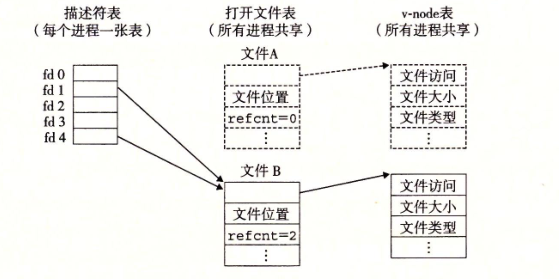

# system io
标准io库无法读取文件的metadata
且高级标准io库不适合网络编程
## unix io view
早期的unix与其他系统不同，不区分文件的类型，仅仅把文件当作字节流。

### 文件类型
regular file:arbitrary data
directory:index of a related group files
socket :for communicating with a process on another machine
pipe
symbolic links
block and character devices

**perror**
检查系统调用返回值，perror打印系统调用的error

### read调用
read返回值
0：已经读到eof或网络连接关闭了
>0:正确
<0:错误

## RIO

## file
### metadata
记录文件本身信息的数据，比如修改时间，文件大小等
### sharefiles

父进程fork出了子进程，父进程和子进程共享了打开文件表，因为他们的文件描述符fd的表是一样的，文件描述符指向了同一个打开文件表，当任意进程读过之后，另外一个进程再进行读时都会从新的位置开始读。 

### redirection
```c
dup2();
```
fd重定向


### sum
1. 面向文本的IO函数不可以对二进制文件使用，可以使用rio函数代替
2. 字符串函数不能对二进制文件使用

## 10.1 unix io
所有的io设备都被视为文件，shell创建的进程的都有三个打开的文件，stdout，stdin和stderr,fd分别是0,1,2

### 打开与关闭文件

```c
#include <fcntl.h>
int open(const char *pathname, int flags, mode_t mode);
```
flags 指明了进程如何访问文件，比如O_RDONLY,O_WRONLY,O_RDWR
也可以在文件不存在的时候创建该文件：O_CREAT,多个flag取值可以相与

mode 指明了新文件的访问权限位，也是有一堆宏


### 练习题10.1
```c
#include <fcntl.h>
#include <stdio.h>
#include <stdlib.h>
#include <unistd.h>
int main() {
  int fd = open("bar.txt", O_RDONLY, 0);
  printf("fd = %d\n", fd);
  exit(0);
}
```

输出为-1,因为bar.txt不存在，所以fd=-1

### 读写文件

```c
#include <unistd.h>
ssize_t read(int fd, void buf[.count], size_t count);
ssize_t write(int fd, const void buf[.count], size_t count);
```
read若读取成功则返回读取的字节数，否则返回-1,write 同理
lseek 可以显式的修改当前文件的位置

ssize_t 为有符号数long 而size_t 为unsigned long


### 10.5 RIO包
rio线程安全的，robust的io库

带缓冲区和不带缓冲区的io函数：
1. 带缓冲区的io函数一次读取较多数据到缓冲区，然后在从缓冲区去数据到用户程序
2. 不带缓冲区则一次读取定量的数据

rio_readlineb
rio_readnb


### 10.6 读取文件元数据

```c
#include <sys/stat.h>

int stat(const char *restrict pathname, struct stat *restrict statbuf);
int fstat(int fd, struct stat *statbuf);
```

stat是输入文件的路径，而fstat则是fd
通过stat函数可以获得文件的元数据比如文件大小，文件修改时间等等。

通过一系列宏可以通过判断stat.st_mode变量来判别文件的类型

```c
S_ISREG(m)  //普通文件？
S_ISDIR(m)  //目录文件？
```

### 10.7 读取目录内容

```c
#include <sys/types.h>
#include <dirent.h>

DIR *opendir(const char *name);
DIR *fdopendir(int fd);
```

返回一个指向目录流的指针


```c
#include <dirent.h>
struct dirent *readdir(DIR *dirp);
```
返回dirp目录中的下一个目录项指针

如果readdir错误，则只能通过errno来区分错误

### 10.8 共享文件

1. 文件描述表：每个进程都有独立的表,表项指向打开文件表的表项
2. 打开文件表：所有进程共享，每一个表项指向一个vnode,同时表项记录了文件引用计数以及文件指针位置等等信息
3. vnode表：所有进程共享,记录文件的元数据

打开文件是从fd到打开文件表到vnode的

### 10.2 foo.txt 文件中有六个字符"foobar" ,程序输出f,因为两个fd对应了两个文件打开表的表项，指针不共享
```c
int main() {
  int fd1, fd2;
  char c;
  fd1 = open("foo.txt", O_RDONLY, 0);
  fd2 = open("foo.txt", O_RDONLY, 0);
  read(fd1, &c, 1);
  read(fd2, &c, 1);
  printf("c = %c\n", c);
  exit(0);
}
``` 


### 10.3 输出o,因为fork后两个进程都有fd指向打开文件表中的表项，该表项cnt为2,且指针共用


```c
int main(){
  int fd;
  char c;

  fd = open("foo.txt",O_RDONLY,0);
  if(fork()==0){
    read(fd,&c,1);
    exit(0);
  }
  wait(NULL);
  read(fd,&c,1);
  printf("c = %c\n",c);
  exit(0);
}
```
### 10.9 io重定向

 

```c
#include <unistd.h>
int dup2(int oldfd, int newfd);
```

将newfd指向的打开表的表项移动到oldfd指向的表项中

### 各种io库的限制与选择

输入和输出函数之间要插入fflush等清空缓冲区的函数

### 习题10.10 cpfile 程序


