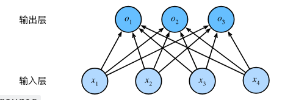
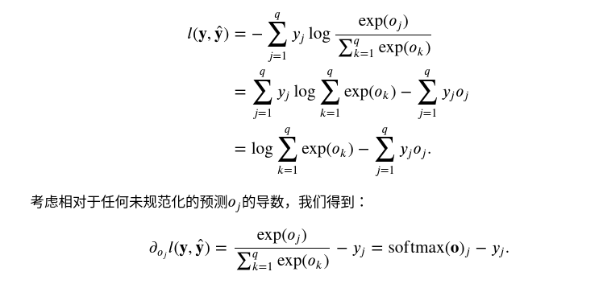
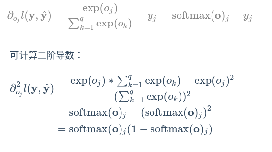

# 动手学深度学习
## 前言
监督学习
1. 回归
2. 分类
3. 标记
4. 搜索
5. 搜索
6. 序列学习，前后的输入是有关联的

无监督学习
1. 将相似行为的数据分成一类
2. 对抗性网络
3. 因果关系

强化学习：执行动作，动作用于环境，获得奖励，继续执行

## 数据操作
获取数据，读入数据进行处理

广播
一行和一列的数据可以进行广播操作，相加之后会扩展行或列变成形状相同的矩阵，然后再相加

切片和索引
`x[0:n,0:n]`意为x的0到n-1行中的0到n-1列的元素，特别的如果单独的一个冒号代表所有行或列

节省内存
`y = x+y`和`y[:]=x+y`是不一样的，第一个的结果y新申请了一块内存，而第二个y是在原地修改y的值


`A.sum(axis=n)`意为对矩阵求和，不保留第n个坐标轴，即张量会降维


## 线性神经网络
### 线性回归
线性模型
损失函数：平方误差，均方误差

梯度下降

线性回归有解析解，但是解析解很难解，一般用梯度下降优化模型


### 线性回归的从零开始实现
```python
import random
import torch
from d2l import  torch as d2l

def generate_data(w,b,num):
    X = torch.normal(0,1,(num,len(w)))
    y = torch.matmul(X,w)+b
    y += torch.normal(0,0.01,y.shape)
    return X,y.reshape((-1,1))
w = torch.normal(0,0.01,size=(2,1),requires_grad=True)
b = torch.zeros(1,requires_grad=True)

def linreg(X,w,b):
    return torch.matmul(X,w)+b
    
def square_loss(y_hat,y):
    return (y_hat-y.reshape(y_hat.shape))**2/2

def sgd(params,learning_rates,batch_size):
    with torch.no_grad():
        for param in params:
            param -= learning_rates*param.grad/batch_size
            param.grad.zero_()

def data_iter(batch_size,features,labels):
    num = len(features)
    indices = list(range(num))
    random.shuffle(indices)
    for i in range(0,num,batch_size):
        batch_indice = torch.tensor(indices[i:min(i+batch_size,num)])
        print(torch.tensor(indices[i:min(i+batch_size,num)]))
        yield features[batch_indice],labels[batch_indice]

lr = 0.03
num_epochs = 3
net = linreg
loss = square_loss
batch_size = 10
true_w = torch.tensor([2, -3.4])
true_b = 4.2
features, labels = generate_data(true_w, true_b, 1000)

for epoch in range(num_epochs):
    for X,y in data_iter(batch_size,features,labels):
        l = loss(net(X,w,b),y)
        l.sum().backward()
        sgd([w,b],lr,batch_size)
        with torch.no_grad():
            train_l = loss(net(features,w,b),labels)
            print(f'epoch {epoch+1} ,loss {float(train_l.mean()):f}')
            epoch+=1
```
通过编写loss函数，以及sgd函数来训练我们的线性回归网络

#### 简化的线性回归网络实现
`Sequential`是一个类，他将多层串联到一起
```python
import numpy as np
import torch
from torch.utils import data
from d2l import torch as d2l
from torch import nn

true_w = torch.tensor([2,-3.4])
true_b = 4.2
features , labels = d2l.synthetic_data(true_w,true_b,1000)
def load_array(data_array,batch_size,is_train=True):
    dataset = data.TensorDataset(*data_array)
    return data.DataLoader(dataset,batch_size,shuffle=is_train)
batch_size = 10
data_iter = load_array((features,labels),batch_size)
#新建网络
#在PyTorch中，torch.nn.Sequential是一个方便的类，
# 用于按顺序组合多个神经网络层。
# 它允许你按照顺序定义和堆叠神经网络层，构建一个完整的神经网络模型。
net  = nn.Sequential(nn.Linear(2,1))

# 初始化weight 和 bias net[0]代表选择网络中的第一层
# 下面的意思是权值初始化为 在期望 0方差0.01的正态分布上随机取值
# bias则全部为0
net[0].weight.data.normal_(0,0.01)
net[0].bias.data.fill_(0)

# 损失函数，使用的是L2范数，他返回所有样本loss的均值
loss = nn.HuberLoss()

# 定义优化算法 
# SGD只需要要优化的参数和学习率两个参数
# 下面的trainer 用net.parameters获得了所有的参数
trainer = torch.optim.SGD(net.parameters(),lr=0.3)


# 训练
num_epochs = 3
for epoch in range(num_epochs):
    for X,y in data_iter:
        l = loss(net(X),y)
        trainer.zero_grad()
        l.backward()
        # trainer通过step自动修改参数了
        trainer.step() 
    l = loss(net(features),labels)
    print(f'epoch {epoch+1},loss {l:f}')

w = net[0].weight.data
b = net[0].bias.data
print('w 误差:',true_w-w.reshape(true_w.shape))
print('b 误差:',true_b-b)
```


### softmax回归
分类问题



为了实现分类问题，我们需要一个有多个输出的模型，每个类别对应一个输出。
同样的，我们也需要与输出一样多的函数，每个输出对应一个函数，函数有4个weight和一个bias,总共12个weight,3个bias

#### 全连接层
即每个输入都与每个输出相连


### softmax 运算

输出yi即为对应类别的概率为yi
但是我们不能将未规范化的预测直接作为输出，因为输出可能是负值，且概率总和必须为1

softmax 函数可以将未规范化的预测变换为非负数并且总和为1,其实就是求幂保证非负，然后进行归一化保证概率和为1

#### 小批量样本的矢量化
使用矢量计算会充分利用gpu,提高gpu 的利用率
#### 交叉熵损失函数
由极大似然估计推导出交叉熵损失函数
##### 交叉熵
熵就是表示事物状态的最小编码长度
熵的公式为 $entropy = -\sum P_p(i) \log P_p(i)$

交叉熵的公式是 $cross entropy = -\sum P_r(i) \log P_p(i)$

$P_r$代表实际的概率，而$P_p$代表预测的概率


#### 对损失函数求导
导数推导过程


损失函数的二阶导数
