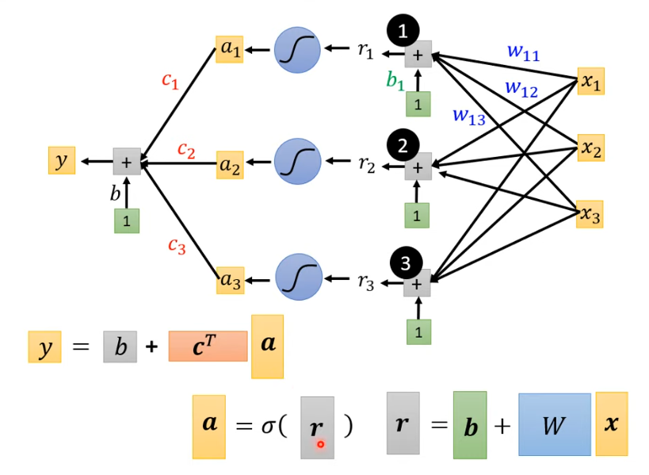
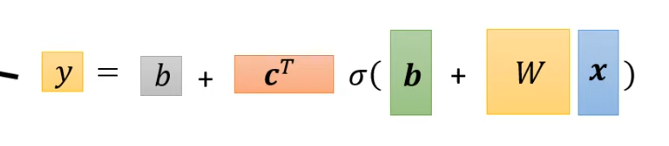

# 机器学习的基本概念
## 函数的分类

`regression`: 输入一些数值，输出一个数值
`classification`：输出类别
`structured learning`： 生成文章，图像等

## 如何找到函数
- 先确定一个函数方程，比如一次函数，二次函数等
- 给出函数参数的初值，根据一些背景知识
  - 参数也分为`weight`和`bias`
- 定义`loss`损失,用于衡量这个函数的预测结果的效果
  - `MSE` `MAE` 等
- `optimization`：让`loss`最小
  - 梯度下降,容易陷入局部最优
  - 学习速率，步长  

## liner model
线性模型太过简单，不能拟合很多场景。

## sigmoid
使用`sigmoid`来生成许多线段，然后将线段叠加去拟合曲线。

这也就是需要激活函数的原因。

 

矩阵乘法
 

最终的函数形式改写为矩阵的形式
 

## 实际的训练过程
把训练数据分成`batch`,然后算每个`batch`的`loss`然后梯度下降调整参数，对所有`batch`都做完上述操作叫做一个`epoch`。

## 为什么deep而不是fat？

