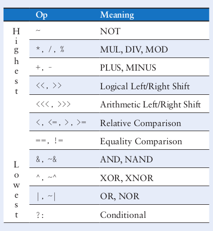

# 数字设计和计算机体系结构riscv版
## preface
## 第一章 从0到1
抽象
一个架构可以被不同的微架构实现，比如intel和amd都实现了x86架构

3个y
hierarchy
modularity
Regularity 寻求模块之间的共通性，减少独特的模块，增加模块的复用性

信息的数量单位为bit,是binary digit的缩写。

受噪声和测量错误的限制，大多数连续信号也只能携带10到16bit的信息，如果对测量的实时性要求高则信息会更少。

### 二进制

1's complement:就是反码
2's complement:补码

### 逻辑门

### 电压

VDD是只系统支持的最大电压

一些标准：
TTL 晶体管晶体管逻辑
CMOS 互补金属半导体逻辑
LVTTL 低压TTL
LVCMOS 低压CMOS

不同的标准的高低电平电压值不同


### exercise 
1.73: 三个输入abc,两个以上为真，输出y才为真
y=a&b&c+a&b&~c+a&c&~b+b&c&~a= a & b + b & ( a & (~c) + (~a) & c )

1.74: y=a&b+c 

1.75: y=~((a+b)&c)

1.78: VIL=2 VIH=3 VOL=1.5 VOH=4

1.79: VIL=1 VIH=3.5 VOL=1 VOH=3.5 VML=0 VML=0,无法抗噪声

1.80: VIL=2 VIH=4 VOL=1 VOH=4.5 VML=1 VMH=0.5 

1.81:     VIL     VIH    VOL    VOH
Ben's :   1.5     1.8    1.2     3.0 
LVCMOS:   0.9     1.8    0.4    2.4
LVTTL:    0.8      2     0.4    2.4 
不可以驱动LVCMOS和LVTTL，但是可以接受LVCMOS和LVTTL的信号

1.82
与门，VIL=2 VIH=2.25 VOL=0 VOH=3

1.83
异或门，VIL=1.5 VIH=2 VOL=0 VOH=3

## 组合逻辑设计 
数字电路分为组合逻辑和时序逻辑两种电路。
组合逻辑是只当前输入产生当前输出，而时序逻辑的输出则还依赖电路内部存储器存储的数据。

### 非法的值 X
当一根高电平和一根低电平汇入一条线时，这条线的值是X,通常在禁区内，这叫contention。
电路模拟器中的X常常代表未初始化的
数字设计师也会用x来代表不在乎的意思在真值表中。

### 浮动的值 Z
Z代表，浮动的值，高阻态。
一个典型的误区：浮动或者未被驱动的节点等价于0，事实上也可能是高电平，或者是高低之间

tristate buffer 三态门
当enable是1时，可以当作buffer,否则输出高阻态
通常用于总线结构中，当多个元器件连接总线时，只有一个元器件可以向总线上发送数据，其他元器件需要三态门使输出变为高阻态

### 卡諾图
1. 圈要尽可能大
2. 圈只能是1，2,4,8等的方块
3. 圈要尽可能少
4. 圈可以跨越边界
5. 1可以重复被圈

### 解码器
38解码器
实际上可以将解码器的输出看作一个真值表，这是典型的sum of products的设计方法，在rom设计时会使用到这个思想。

### timing
上升沿和下降沿
我们将测量到的上升到一半的输入和上升到一半的输出之间的时间被称为延时，delay
propagation delay,传播延时,输入变化到输出稳定的时间
contamination delay 污染延时，输入变化到输出变化的时间

delay的原因:元器件发热，元器件之间的速度不同
传播延时等于关键路径的延时，而污染延时则等于最短路径上的延时

冒险现象 glitch 当某个输入改变导致中间输出改变后又导致最终输出改变(由于速度的原因)，被称之为冒险

从卡諾图上看，当一个圈内的1跑到另外一个圈的1时，可能会出现glitch的现象,我们可以圈起这两个1(一个状态转换引发的输出变化必然是挨着的两个1),增加一些无关项，消除冒险


## 时序逻辑设计

flip flops:d触发器
latches:锁存器

### 双稳态结构


#### SR锁存器

有两个输入端S为set,R为reset
如果两个输入端都为1,则两个输出都为false
如果两个都为0,则保持原来的状态

#### D latch


两个输入，一个是clk,一个是data
只有当clk是高的时候，data才会被输入sr锁存器。
如果clk为低，则sr锁存器两个输入都是0,不会改变内部状态

#### D filpflop
D触发器


使用了两个dlatch来组成。
当边沿上升的时候，L1的输出传递给L2的输入，且L1由于clk变低，L2clk变高，导致L1不再接受输入，L2开始接受输入，使得最终输出在上升沿处发生变化，其他时候保留上一状态的值

还有一些其他的D触发器
enable的D触发器
resettable的D触发器，复位还分为同步和异步，异步复位可以在输出端加一个与门，与reset输入相与得到输出

#### 同步时序逻辑电路
组合逻辑+寄存器

一些规则：
电路元素是寄存器或组合逻辑
至少有一个元素是寄存器
所有寄存器接受相同的clk
每个循环路线包括至少一个寄存器

#### 异步和同步电路
#### 有限状态机
有限状态机电路分为两个组合逻辑部分：产生下一个状态的逻辑和输出逻辑
moore machine 输出只与当前状态有关
mealy machine 输出与当前状态和输入有关


可以对状态，输入和输出编码然后写出真值表以及逻辑表达式，然后可以按照逻辑表达式进行电路设计。可是编码不同会导致电路设计的不同。
如何设计出最少的逻辑门的电路或者最小传播时延的电路这里是没有简单的方法，对于大量的状态穷举也是不太可能的。
观察相关的状态或者输出的信息可以挑选出较好的编码方式

编码可以分为二进制编码和one hot编码
one hot编码的意思是有多少个要编码的状态就有多少位编码，每一位代表一个状态

当设计mealy machine写真值表的时候要注意有一栏输入

fsm的设计
- 确认输入和输出
- 画出状态转换图
- 对于moore机
  - 写出状态转换表以及输出表
- 对于mealy机
  - 写出结合的状态转换图和输出表
- 选择编码方式
- 写出布尔表达式
- 设计出电路

#### 时序逻辑电路的timing
D触发器对边沿的响应被称为对输入的采样.
当边沿时输入也发生了变化，那么会发生什么？
所以时序逻辑中输入必须保持一定的时间为了让触发器产生相应的输出

setup time和hold time，分别对应了边沿前后的一段需要输入保持稳定的时间,setup是为了sample,hold是为了sample,在输入改变前就进行采样，如果hold为0是最好的

clock skew: 同一个时钟源到达不同的时序元器件的时间不同

动态设计准则：
同步时序电路必须在aperture time(setup + hold time)时稳定。

setup time constrait:Tpd<= Tc -(Tpcq+Tsetup)
解释：在时钟周期内要完成输入信号的稳定，否则到了边沿输入信号可能又会面临改变，影响输入的sample
Tpcq是时序逻辑的传播时延
Tccq是时序逻辑的污染时延
hold time constraint: Tcd>=Thold-Tccq
解释：当clk上升沿时触发器存储数据需要D hold一段时间，而此时该触发器前面的电路的输出也改变了，导致了该触发器的输入也面临改变，因此需要在输入改变前将输入进行sample
如果setup时间达不到要求可以提高Tc也就是时钟周期,但是如果holdtime不达标则只能重新设计电路,可以增加buffer以便增加时延使得总时延大于holdtime

亚稳态
当触发器采样到一个禁区的值的时候，触发器会解决这个问题，存储一个稳态值，但是需要一些时间，且时间是unbounded

每一个双稳态元器件都会在两个稳态之间有一个亚稳态


同步器
输入最好经过同步器，以保证时序元件不会产生亚稳态。
输入如果在aperture内稳定，则输出也会是稳定的，如果输入在aperture内不稳定，那么在有限时间内会输出一个稳定信号。

#### 并行
系统的速度是被延迟和信息通过的速度所确定的，我们把token定义为一组输入通过系统产生一组输出
latency就是指tokens产生的时间
throughout是指tokens产生的速度

并行分为sptial并行和temporal并行
spatial是指多个任务同时进行
而temporal并行是指类似流水线的处理

流水线的烦恼：如果该流水段结果依赖后面的流水段的结果，则会发生冲突。


## HDL
构建module的方法有两种：行为建模和结构建模，行为建模描述了模块做了什么，而结构建模则描述了模块的构成。

y=(~a)(~b)(~c)+(a)(~b)(~c)+(a)(~b)(c)

```systemverilog
module sillyfunction(
  input logic a,b,c,
  output logic y);
  assign y=~a&~b&~c|a&~b&~c|a&~b&c;
endmodule
```
logic是systemverilog中替代reg的关键字，可以被连续赋值(assign)和过程赋值(structural),编译器会推断logic是wire还是reg,除了会被多重驱动使用的信号，其他地方的reg和wire都应该使用logic替代。

**一个模块应该有很好的模块应用性**

模拟和综合

模拟就是给module一个输入，去检查输出是否正确.
综合就是将代码描述转换成逻辑门

位操作符：& ~ | 

连续赋值：assign语句，无论右边的元素是否改变，左边都会被重新计算

单目运算符：& |  ^

三目运算符： a?b:c 三目运算符可以嵌套使用 比如`a?(b?c:d):(e?f:g)`

运算符的优先级：




移位运算符：<<>>是逻辑移位 <<<>>>是算数移位

数字表达式:**`'0`和`’1`会把所有位都填充成0或1**


#### Z和X
z代表浮动的值，常用在三态门中，当ena位0时
x代表无效的电平，比如总线上的两个三态门都是1导通，则此时的总线上的值为x
当触发器的输入未被定义时，也会用x来代表初值

`output tri y`表示y是一个三态总线，可以支持多重驱动，当无驱动的时候输出z

#### delay
可以在assign前加`#n`来延迟几个时间单位来延迟赋值，只用于模拟环节，综合时无效

`timescale 1ns/1ps`前面的是时间单元，后面的是时间精度

延时赋值的时候如果本句assign依赖其他的assign的结果，则会在依赖的assign赋值完成后再去延时赋值

#### 行为建模
#### 时序逻辑
寄存器
`always_ff@(edge)` 敏感信号只能是边沿形式的，而且内部被赋值的元素只能是reg类型而非wire

resettable reg 异步，同步只需要去掉posedge reset就可以了
```systemverilog
module flopr(
  input logic clk,reset,
  input logic[3:0] d,
  output logic[3:0] out
);
  always_ff@(posedge clk,posedge reset)
    if (reset) q<=4'b0;
    else q<=d;
endmodule
```


D latch 锁存器
```systemverilog
module latch(
  input logic clk,
  input logic[3:0] d,
  output logic[3:0] q
);
  always_latch
    if(clk)q<=d;
endmodule
```
`always_latch` 等价于`always@(clk,d)`


Inverter
```systemverilog
module inv(
  input logic a,
  output logic y
);
  always_comb
    y=~a;
endmodule
```
`always_comb`等价于`always@(*)`,当赋值语句右边改变再去进行计算，此外，`always_comb`内的代码必须是组合逻辑的

阻塞赋值和非阻塞赋值
对于组合逻辑来说使用阻塞赋值，而时序逻辑则使用非阻塞赋值
在always内，阻塞赋值是顺序执行的，而非阻塞赋值是并行的

两种赋值语句的准则


阻塞赋值和非阻塞赋值
对于组合逻辑来说使用阻塞赋值，而时序逻辑则使用非阻塞赋值
在always内，阻塞赋值是顺序执行的，而非阻塞赋值是并行的

两种赋值语句的准则
1. 在always内对时序电路使用 非阻塞赋值
2. 对简单的组合逻辑电路使用 连续赋值
3. 用always来实现一些复杂的组合逻辑(SystemVerilog 中使用always_comb)
4. 在always内和 连续赋值语句中不能对一个信号重复赋值