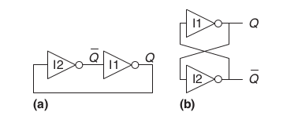
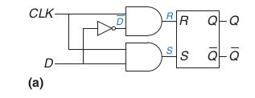
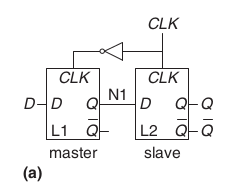

# 数字设计和计算机体系结构riscv版
## preface
## 第一章 从0到1
抽象
一个架构可以被不同的微架构实现，比如intel和amd都实现了x86架构

3个y
hierarchy
modularity
Regularity 寻求模块之间的共通性，减少独特的模块，增加模块的复用性

信息的数量单位为bit,是binary digit的缩写。

受噪声和测量错误的限制，大多数连续信号也只能携带10到16bit的信息，如果对测量的实时性要求高则信息会更少。

### 二进制

1's complement:就是反码
2's complement:补码

### 逻辑门

### 电压

VDD是只系统支持的最大电压

一些标准：
TTL 晶体管晶体管逻辑
CMOS 互补金属半导体逻辑
LVTTL 低压TTL
LVCMOS 低压CMOS

不同的标准的高低电平电压值不同

### exercise 
1.73: 三个输入abc,两个以上为真，输出y才为真
y=a&b&c+a&b&~c+a&c&~b+b&c&~a= a & b + b & ( a & (~c) + (~a) & c )

1.74: y=a&b+c 

1.75: y=~((a+b)&c)

1.78: VIL=2 VIH=3 VOL=1.5 VOH=4

1.79: VIL=1 VIH=3.5 VOL=1 VOH=3.5 VML=0 VML=0,无法抗噪声

1.80: VIL=2 VIH=4 VOL=1 VOH=4.5 VML=1 VMH=0.5 

1.81:     VIL     VIH    VOL    VOH
Ben's :   1.5     1.8    1.2     3.0 
LVCMOS:   0.9     1.8    0.4    2.4
LVTTL:    0.8      2     0.4    2.4 
不可以驱动LVCMOS和LVTTL，但是可以接受LVCMOS和LVTTL的信号

1.82
与门，VIL=2 VIH=2.25 VOL=0 VOH=3

1.83
异或门，VIL=1.5 VIH=2 VOL=0 VOH=3

## 组合逻辑设计 
数字电路分为组合逻辑和时序逻辑两种电路。
组合逻辑是只当前输入产生当前输出，而时序逻辑的输出则还依赖电路内部存储器存储的数据。

### 非法的值 X
当一根高电平和一根低电平汇入一条线时，这条线的值是X,通常在禁区内，这叫contention。
电路模拟器中的X常常代表未初始化的
数字设计师也会用x来代表不在乎的意思在真值表中。

### 浮动的值 Z
Z代表，浮动的值，高阻态。
一个典型的误区：浮动或者未被驱动的节点等价于0，事实上也可能是高电平，或者是高低之间

tristate buffer 三态门
当enable是1时，可以当作buffer,否则输出高阻态
通常用于总线结构中，当多个元器件连接总线时，只有一个元器件可以向总线上发送数据，其他元器件需要三态门使输出变为高阻态

### 卡諾图
1. 圈要尽可能大
2. 圈只能是1，2,4,8等的方块
3. 圈要尽可能少
4. 圈可以跨越边界
5. 1可以重复被圈

### 解码器
38解码器
实际上可以将解码器的输出看作一个真值表，这是典型的sum of products的设计方法，在rom设计时会使用到这个思想。

### timing
上升沿和下降沿
我们将测量到的上升到一半的输入和上升到一半的输出之间的时间被称为延时，delay
propagation delay,传播延时,输入变化到输出稳定的时间
contamination delay 污染延时，输入变化到输出变化的时间

delay的原因:元器件发热，元器件之间的速度不同
传播延时等于关键路径的延时，而污染延时则等于最短路径上的延时

冒险现象 glitch 当某个输入改变导致中间输出改变后又导致最终输出改变(由于速度的原因)，被称之为冒险

从卡諾图上看，当一个圈内的1跑到另外一个圈的1时，可能会出现glitch的现象,我们可以圈起这两个1(一个状态转换引发的输出变化必然是挨着的两个1),增加一些无关项，消除冒险

## 时序逻辑设计

flip flops:d触发器
latches:锁存器

### 双稳态结构

#### SR锁存器

有两个输入端S为set,R为reset
如果两个输入端都为1,则两个输出都为false
如果两个都为0,则保持原来的状态

#### D latch

两个输入，一个是clk,一个是data
只有当clk是高的时候，data才会被输入sr锁存器。
如果clk为低，则sr锁存器两个输入都是0,不会改变内部状态

#### D filpflop
D触发器

使用了两个dlatch来组成。
当边沿上升的时候，L1的输出传递给L2的输入，且L1由于clk变低，L2clk变高，导致L1不再接受输入，L2开始接受输入，使得最终输出在上升沿处发生变化，其他时候保留上一状态的值

还有一些其他的D触发器
enable的D触发器
resettable的D触发器，复位还分为同步和异步，异步复位可以在输出端加一个与门，与reset输入相与得到输出

#### 同步时序逻辑电路
组合逻辑+寄存器

一些规则：
电路元素是寄存器或组合逻辑
至少有一个元素是寄存器
所有寄存器接受相同的clk
每个循环路线包括至少一个寄存器

#### 异步和同步电路
#### 有限状态机
有限状态机电路分为两个组合逻辑部分：产生下一个状态的逻辑和输出逻辑
moore machine 输出只与当前状态有关
mealy machine 输出与当前状态和输入有关

可以对状态，输入和输出编码然后写出真值表以及逻辑表达式，然后可以按照逻辑表达式进行电路设计。可是编码不同会导致电路设计的不同。
如何设计出最少的逻辑门的电路或者最小传播时延的电路这里是没有简单的方法，对于大量的状态穷举也是不太可能的。
观察相关的状态或者输出的信息可以挑选出较好的编码方式

编码可以分为二进制编码和one hot编码
one hot编码的意思是有多少个要编码的状态就有多少位编码，每一位代表一个状态

当设计mealy machine写真值表的时候要注意有一栏输入

fsm的设计
- 确认输入和输出
- 画出状态转换图
- 对于moore机
  - 写出状态转换表以及输出表
- 对于mealy机
  - 写出结合的状态转换图和输出表
- 选择编码方式
- 写出布尔表达式
- 设计出电路

