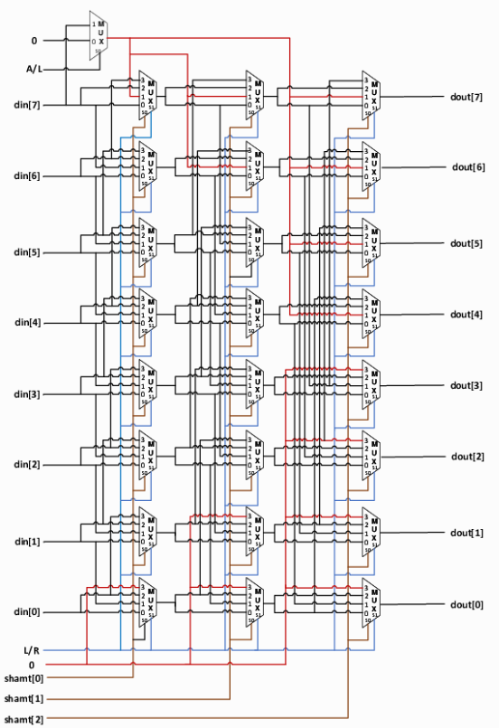

# 数电实验
## 实验一 选择器
数据流建模 通过表达式直接计算输入到输出
结构化建模 从门电路到整个设计
行为建模 不推荐 类似c变成，流程化的处理信号

### 通用的选择器模板
NR_KEY是键值对的个数，key是输入select的值，value就是对应的输出，KEY_LEN就是输入的宽度，DATA_LEN就是输出的宽度，lut是一个数组，数组当中存放的是键值对，一个key一个value这样存放的
```verilog
module MuxKeyInternal #(NR_KEY = 2, KEY_LEN = 1, DATA_LEN = 1, HAS_DEFAULT = 0) (
  output reg [DATA_LEN-1:0] out,
  input [KEY_LEN-1:0] key,
  input [DATA_LEN-1:0] default_out,
  input [NR_KEY*(KEY_LEN + DATA_LEN)-1:0] lut
);

  localparam PAIR_LEN = KEY_LEN + DATA_LEN;
  wire [PAIR_LEN-1:0] pair_list [NR_KEY-1:0]; //pairlist,二维数组类似，没一行是一个键值对
  wire [KEY_LEN-1:0] key_list [NR_KEY-1:0]; //keylist
  wire [DATA_LEN-1:0] data_list [NR_KEY-1:0];//datalist

  generate
    for (genvar n = 0; n < NR_KEY; n = n + 1) begin
      assign pair_list[n] = lut[PAIR_LEN*(n+1)-1 : PAIR_LEN*n];
      assign data_list[n] = pair_list[n][DATA_LEN-1:0];
      assign key_list[n]  = pair_list[n][PAIR_LEN-1:DATA_LEN];
    end
  endgenerate

  reg [DATA_LEN-1 : 0] lut_out;
  reg hit;
  integer i;
  always @(*) begin
    lut_out = 0;
    hit = 0;
    for (i = 0; i < NR_KEY; i = i + 1) begin
      lut_out = lut_out | ({DATA_LEN{key == key_list[i]}} & data_list[i]);
      hit = hit | (key == key_list[i]);
    end
    //遍历lut去找key是否相同，赋值的方式很巧妙。
    if (!HAS_DEFAULT) out = lut_out;
    else out = (hit ? lut_out : default_out);
  end

endmodule

module MuxKey #(NR_KEY = 2, KEY_LEN = 1, DATA_LEN = 1) (
  output [DATA_LEN-1:0] out,
  input [KEY_LEN-1:0] key,
  input [NR_KEY*(KEY_LEN + DATA_LEN)-1:0] lut
);
  MuxKeyInternal #(NR_KEY, KEY_LEN, DATA_LEN, 0) i0 (out, key, {DATA_LEN{1'b0}}, lut);
endmodule

module MuxKeyWithDefault #(NR_KEY = 2, KEY_LEN = 1, DATA_LEN = 1) (
  output [DATA_LEN-1:0] out,
  input [KEY_LEN-1:0] key,
  input [DATA_LEN-1:0] default_out,
  input [NR_KEY*(KEY_LEN + DATA_LEN)-1:0] lut
);
  MuxKeyInternal #(NR_KEY, KEY_LEN, DATA_LEN, 1) i0 (out, key, default_out, lut);
endmodule
```

## 译码器

## ALU
`{out_c,out_s}=in_x+in_y`,两个n位输入相加产生n+1位的输出。

减法器也可以用加法器实现，但是在减去负数最小值的时候对结果的溢出需要做一个单独的处理,这里有两个处理哪一种是正确的？
第一种
```systemverilog
assign t_no_Cin={n{Cin}}^B;
assign {Carry,Result} = A + t_no_Cin +Cin;
assign Overflow = (A[n-1] == t_no_Cin[n-1]) && (Result[n-1]!=A[n-1]);
```
第二种
```systemverilog
assign t_add_Cin=({n{Cin}}^B)+Cin;
assign {Carry,Result} = A + t_add_Cin;
assign Overflow = (A[n-1] == t_add_Cin[n-1]) && (Result[n-1]!=A[n-1]);
```

第一种是正确的，因为第二种在减去负数最大值M的时候 `t_add_Cin`实际上就是-M的补码表示，-M的符号与M相反，但是由于它是最小的负数，所以M补码取反+1后不变，符号也没变，第二种方法判断溢出不可行，而第一种可以，因为-M和M的符号一定相反，所以直接取反的最高位一定是正确的符号位.

实现四位带符号位的补码ALU
1. 实现加，减，取反，与，或，异或，以及比较大小和相等的功能

## 桶型移位寄存器
组合逻辑构成，由一大堆mux组成
比如8位宽的移位寄存器有端口
1. 8b数据输入
2. 8b数据输出
3. 3b移位位数
4. 方向
5. 逻辑或数字

3b移位位数连接到三组mux分别对应移1位，2位，和4位，每组mux的四个输入有两个是本位数据，还有两个是上下1,2,4位，mux的s段高位为方向输入，代表选择左移(即选择下方的数据)或右移(反之亦然)的数据位，而s的低位则连接每组mux对应的移位位数的对应位，选择是否移位.

