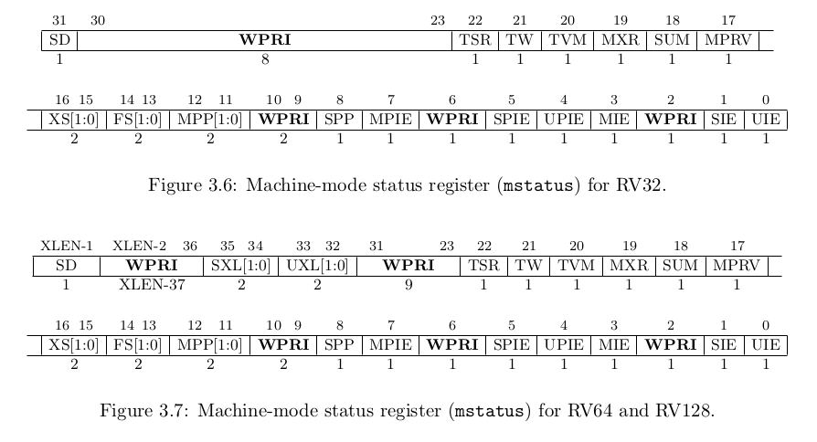

# pa1
## NEMU
NEMU是一个全系统模拟器

编译慢：
可以使用`make -j?`来编译，因为make默认使用单线程顺序编译所有文件。
其中`?`指的是核的数量。

当`make clean`后，并未修改源代码，再次编译的结果应该和上一次一模一样，所以可以通过`ccache`实现保存编译结果。


什么是ISA,指令集架构
ISA实际上是一本规范手册，计算机硬件需要按照ISA规范手册进行实现，而程序也要按照ISA手册编写或生成。

## 最简单的计算机

寄存器存放正在处理的数据，pc指向下一条指令的地址。
计算机要做的事情大概是
```c
while(1){
    从pc处取指令;
    执行；
    更新pc；
}
```

这就是大名鼎鼎的图灵机，需要满足的条件有：
1. 存储器，PC,寄存器，加法器
2. 不断的取指令，执行以及更新PC

计算机是个状态机
计算机=组合逻辑部件+时序逻辑部件


从状态机的视角理解程序的运行
(0,x,x)->(1,0,x)->(2,0,0)->(3,0,1)->(4,1,1)->(2,1,1)->(3,1,2)->(4,3,2)->(2,3,2)->(3,3,3)->(4,6,3)....->(2,4851,98)->(3,4851,99)->(4,4950,99)->(2,4950,99)->(3,4950,100)->(4,5050,100)->(5,5050,100)


## nemu源代码
### 配置生成的文件
nemu/include/generated/autoconf.h, 宏定义，阅读C代码时使用
nemu/include/config/auto.conf, makefile的参数，阅读Makefile时使用

#### 宏
`IFDEF(CONFIG_DEVICE, init_device());`是表示宏有定义，就init函数
这个宏的原型是
`#define IFDEF(macro, ...) MUXDEF(macro, __KEEP, __IGNORE)(__VA_ARGS__)`
其中`__KEEP`和`__IGNORE`是宏定义，具体的函数在`__VA_ARGS__`中
IFDEF展开后为 `MUXDEF(CONFIG_DEVICE,__KEEP,__IGNORE)(init_device());`
**其中keep就是__VA_ARGS__,而ignore是空定义,所以IFDEF展开为**
`MUXDEF(CONFIG_DEVICE,init_device(),)(init_device());`

`#define MUXDEF(macro, X, Y)  MUX_MACRO_PROPERTY(__P_DEF_, macro, X, Y)`

再次展开后为`MUX_MACRO_PROPERTY(__P_DEF_,CONFIG_DEVICE,init_device(),);`
```c
#define __P_DEF_1  X, 
#define __P_DEF_0  X,
```

`#define MUX_MACRO_PROPERTY(p, macro, a, b) MUX_WITH_COMMA(concat(p, macro), a,b)`

再次展开为`MUX_WITH_COMMA(concat(__P_DEF_,CONFIG_DEVICE),init_device(),);`
其中`CONFIG_DEVICE`只要被定义为0和1,那么`__P_DEF_CONFIG_DEVICE`就会被展开成`__P_DEF_1`或0，最终变成`X,`

`#define MUX_WITH_COMMA(contain_comma, a, b) CHOOSE2nd(contain_comma a, b)`
再次展开为`CHOOSE2nd(X,init_device(),)`
选择第二个参数即这个函数，也就实现了用宏判断其他宏有没有定义(定义为0和1即是有定义)，有定义就执行某个函数。

#### getopt_long
```c
int getopt_long(int argc, char * const argv[],
          const char *optstring,
          const struct option *longopts, int *longindex);
```
optstring是所有的合法指令字符序列，当字符后面跟了一个分号的时候要求该指令需要一个参数
`getopt_long`函数比`getopt`多了支持两个dash开头的长选项,如果只支持长选项，那么optstring应该为`""`而非NULL

```c
struct option
{
  const char *name;
  /* has_arg can't be an enum because some compilers complain about
     type mismatches in all the code that assumes it is an int.  */
  int has_arg;
  int *flag;
  int val;
};
```
longopts指向了一个option的结构体数组，数组包含了所有的长指令
最后一个参数如果不是NULL的话，函数执行后会修改该值为对应指令在options数组内的index


#### cmd_c(-1)什么意思？
uint64的-1的机器数是全1,因为是unsigned,所以他是uint64中最大的数，我猜意思就是让程序一直执行下去，直到程序运行结束，state不再是running.


#### debug
log:输出调试信息，会输出log所在的文件行号和函数
assert:
panic:无条件的assertion fail


#### makerun 后直接q会出现一个错误
这个错误是因为直接q后返回值是1,而c后再q返回值是0.
修改源代码使得q之后程序返回值也为0即可。

经过rtfsc,发现直接将`nemu_state.state`的初值修改为`NEMU_QUIT`即可，~~应该~~并不会影响到程序的运行


## 实现NEMU中的sdb 简易调试器
### 解析指令
`readline(char *prompt)`:可以通过readline读取行输入，然后通过add_history来将输入过的指令加入历史，以便使用上下键去查找输入历史

`strtok(str,delim)`:将str分隔成多个tokens,首次调用时对传入str,之后再调用的时候str参数应为NULL。每一次调用返回下一个tokens


### auipc
一条riscv的指令，格式为
`auipc rd,imm`
执行的结果是 rd = imm<<12+pc ~~存疑~~

### 为什么int3是1byte
```assembly
    jz foo 
    ins2
foo:
    ins3
```
如果ins2是1字节的机器码，且int3是2字节，则如果要在ins2处设置断点且jz处执行了foo分支，导致断点没有触发的话，ins3的机器码就变成了被修改1字节的了。


### 实验报告
1. 画出状态机，我写的状态转换图
```
// PC: instruction    | // label: statement
0: mov  r1, 0         |  pc0: r1 = 0;
1: mov  r2, 0         |  pc1: r2 = 0;
2: addi r2, r2, 1     |  pc2: r2 = r2 + 1;
3: add  r1, r1, r2    |  pc3: r1 = r1 + r2;
4: blt  r2, 100, 2    |  pc4: if (r2 < 100) goto pc2;   // branch if less than
5: jmp 5              |  pc5: goto pc5;
```
(pc,r1,r2)
状态转换过程如下:
(0,x,x)->(1,0,x)->(2,0,0)-(3,0,1)->(4,1,1)->(5,1,1)->(3,1,2)->(4,3,2)->(5,3,2)->(3,3,3)->(4,6,3)->(5,6,3)->(3,6,4)->........->(3,1+2+3+.....98,99)->(4,1+2+3+....99,99)->(5,1+2+3+.......99,99)->(3,1+2+3+....99,100)->(4,1+2+3+.....100,100)->(5,5050,100)->(6,5050,100)卡在这条指令不动了

2. 理解基础设施：
- 假设你需要编译500次NEMU才能完成PA. (一次2s)
- 假设这500次编译当中, 有90%的次数是用于调试. (450 for debug)
- 假设你没有实现简易调试器, 只能通过GDB对运行在NEMU上的客户程序进行调试. 在每一次调试中, 由于GDB不能直接观测客户程序, 你需要花费30秒的时间来从GDB中获取并分析一个信息. (30s 一个信息)
- 假设你需要获取并分析20个信息才能排除一个bug. (600s 一个bug)

编译1000s,450次用于调试，每次调试1获取一个信息，30s，调试共30*450 = 13500s 约为 225分钟 这仅仅是调试的时间

3. RTFM
- riscv32 有几种指令格式 (riscv 指令集手册卷1 )
  - 4种，分别是R I S U四种
- LUI的指令行为是什么 (同上)
  - LUI指令将指令高20位存放的立即数存入目的寄存器高位，寄存器低12位置0
- mstatus寄存器的结构是怎样的 (riscv 指令集手册卷2)
  - 如下图



4. shell命令
在nemu路径下有个count.sh
5. gcc 编译选项中的-Wall和-Werror是什么意思
   - Wall是指显示所有的warning
   - Werror 指将所有的warning都变成error